ICTF is a practice competition that does not equate to much except for practice. However, this does not mean they are all easy. These challenges are meant to simulate real ones, usage of websites, terminal, pwning, and so much more. All just for practice with the work and dedication of the board team. They generally release challenges once on the daily and reset the round every month. We have just finished round 5 and equated to 1122 members, of which we have gained almost 500 members in one month. All of which agree is a good community. As I am writing this, I have became a board member along with another player named Jibe to help create challenges. If you would like to join, click on the link below.

> <https://discord.gg/Z4Vn9bw2uX>

# Sanity Check Round 5 

[Misc]

> The flag is ictf{r0und_5_w0w!}

This is just a starting challenge for those new to understand how the round starts and how to submit flags. You may join in at anytime but for those waiting for the new round is perfect for them. 

This is the flag.

> ictf{r0und_5_w0w!}

# muh-bacon

[Crypto]

> Starting off with a simple challenge (or maybe not?). Have fun!
>
> ictf{11100101111110010111110101001010010101010100111111?}
>
>
>
>
>
>
>
>
>
>
>
>
>
>
>

Anyone with no context would of immediately assumed it was binary, however it is important to take note to the name of the challenge. It said, "bacon". Perhaps it is a bacon cipher with letters being 1 and 0. With this I went to my go to website [cryptii](https://cryptii.com/).

<code>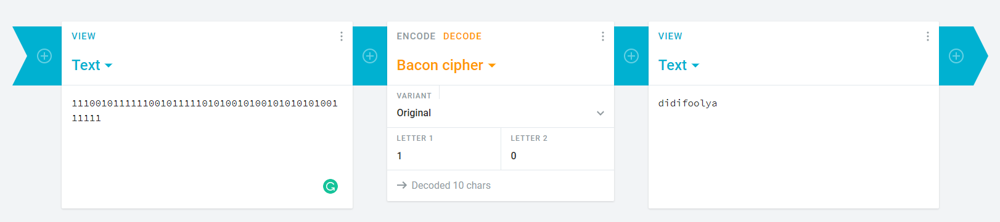</code>

This is the flag.

> ictf{DIDIFOOLYA?}

# broken-png1

[Forensics]

> First problem for the Fix Broken PNG series.
But before that, solve broken-png0.
>
> <https://fdownl.ga/CB07F4AA2F>
>
>
>
>
>
>
>
>
>
>
>
>
>
>
>

Based on the name of the challenge, it seems there is a problem with the png. So I went to a hex editor called HxD, remains to be my favourite, and we immediately see the PNG file header is missing. 

<code>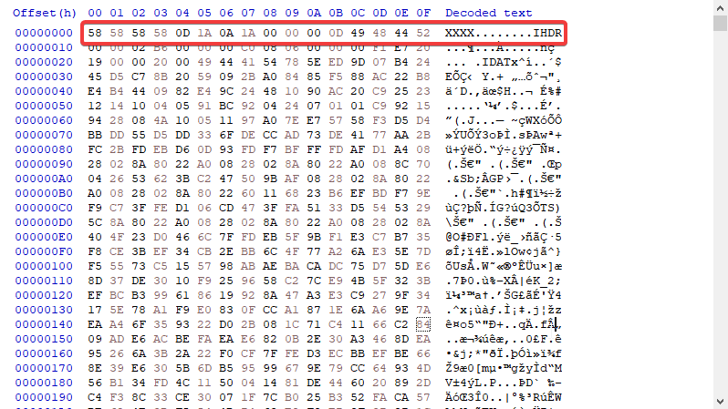</code>

Making sure that the IEND chunk ender is also not missing, it seems alright. So we just need to fix the header. The hex to PNG file header is the following 8 bytes.

> 89 50 4E 47 0D 0A 1A 0A

<code>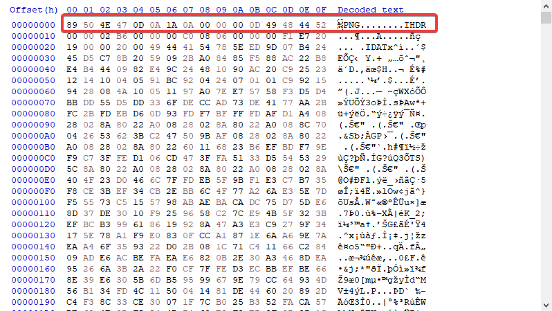</code>

This is the flag we get... but wait there is more!

<code>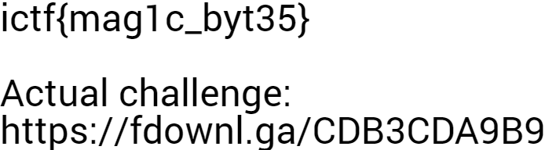</code>

In the following link named the "Actual challenge", we get access to [broken1](https://fdownl.ga/CDB3CDA9B9), the name of the challenge. At first look in the hex view of this file, we saw everything we didnt look for in the broken0 file, with more.

I see a IHDR chunk missing, IDAT chunk messed up, and IEND just gone. So let's fix this using the same technique. For all png challenges such as this one and the future, I utilize this [website](https://en.wikipedia.org/wiki/Portable_Network_Graphics), yes the classic wikipedia. But a lot of the time, you could just use other images as a reference. After fixing this file, we get these flags. 

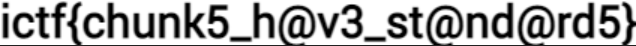

> ictf{mag1c_byt35}
>
> ictf{chunk5_h@v3_st@nd@rd5}

# Bad Naming

[Reversing]

> Timmy just learned python, but he isn't good at naming variables. Try to find out what the variable important is, and put it after pastebin.com/ to get the flag.
>
> <https://fdownl.ga/D17B1002B7>
>
>
>
>
>
>
>
>
>
>
>
>
>
>
>

From a standpoint of knowing how to code, this is really easy, if not, then bruteforce still works, will take a while though. But let's analyze the code.

```python
important = ""
pip_important = "ictf{7h1s_f1@g_1s_1mp0r7an7_bu7_s@d1y_f@k3}"
import base64
randomvar = important.encode('ascii')
important_tottaly = base64.b64encode(randomvar)
import random
nothin_important = important_tottaly.decode('ascii')
import turtle
pip_important = ""
supa_strong = ""
for n in nothin_important:
  n = ord(n)
  n += 1
  n = chr(n)
  pip_important += n
if pip_important == "Ro[4OEC4[UV>":
    print("impressive!")
else:
    print("Disapointing...")
```

When looking at what is needed to be done, I think the most important parts were the checks themselves. We have `if pip_important == "Ro[4OEC4[UV>"` then it outputs impressive. Meaning this is some form of our encrypted flag. Reading through the earlier part of the code, it seems pip_important is pointless at the early start, however, some value of important is being encoded into base64 and used to get the final value of pip. 

Let's clean up the code

```python
import base64

important = "" #Some Value is in here which is the flag

randomvar = important.encode('ascii')
important_tottaly = base64.b64encode(randomvar)
nothin_important = important_tottaly.decode('ascii') # Flag goes from bytes to ascii
pip_important = ""
for n in nothin_important:
  n = ord(n) #Convert to numbered ascii form
  n += 1 # Adds one
  n = chr(n) # Converts back, so it is the next value
  pip_important += n
if pip_important == "Ro[4OEC4[UV>":
    print("impressive!")
else:
    print("Disapointing...")
```

Definitely a lot better looking and some of my annotations. So let's start making a script to solve this challenge. We can use the fact that pip important is equal to that final string, and then let it go into the for loop. This is to revert to the original to the original b64 string, and then just decode to ascii. 

```python
import base64

important = ""
pip_important = "Ro[4OEC4[UV>"

for n in pip_important:
  n = ord(n)
  n -= 1
  n = chr(n)
  important += n

flag = base64.b64decode(important)
print(flag)
```

> [Script](./123solve.py)

After running this, we get this string. 

> Bvw40we5

Important to note that in the challenge description, it mentions that we must use the reversed string as a pastebin [link](https://pastebin.com/Bvw40we5).

This is our flag.

> ictf{n1c3_r3v3r$1ng_$k1lzzz}

# broken-png2

[Forensics]

> Second problem for the Fix Broken PNG series.
>
> <https://fdownl.ga/9A891BA8FC>
>
>
>
>
>
>
>
>
>
>
>
>
>
>
>

Welcome to part two of the quartet. Using the same tool as the last broken-png, we were able to have noticible differences. It seems that IHDR is not on the same chunk as PNG, IDAT is missing or messed up, and now there is a new player called PLTE. 

<code>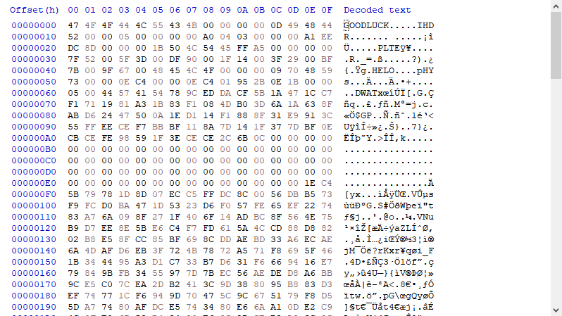</code>

If you search up what this is, it is just a pallete helper, but IDAT is needed. It is assumed that DWAT was a messed up version of IDAT but let's go in order. First fixing PNG and removing one byte to get IHDR on the same chunk. Then went to just type in IDAT in place of DWAT. As I saw nothing else was missing, I loaded the file.

<code></code>

This is our flag.

> ictf{CRC_is_linear_over_XOR}

# Race Competition

[Web]

> Hey there! One of my friends is running a race competition! Will you get the first place? He also told me that special participants have also the right to claim a flag, but I don't know nothing about tradings...
>
> <https://racecompetition.ctfchallenge.ga/>
>
>
>
>
>
>
>
>
>
>
>
>
>
>
>

<code>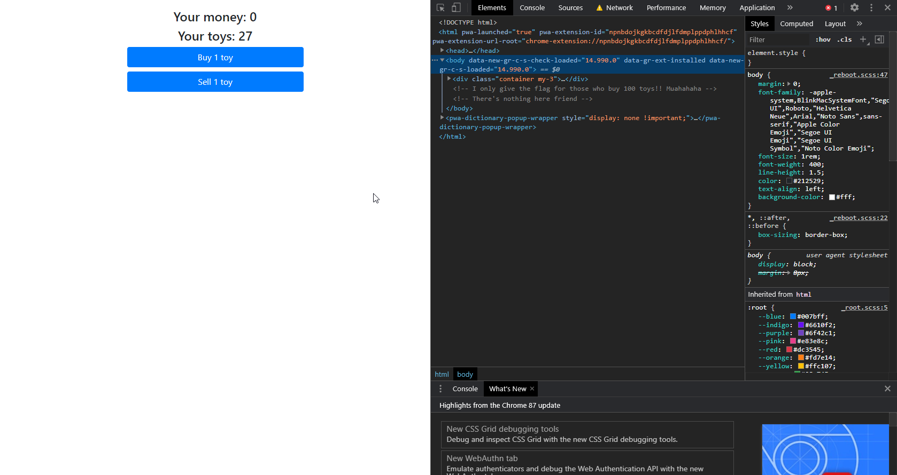</code>

This one did stump me for a bit until I searched up the challenge name. Thats when I got to a form of an exploit called [Race Conditions](https://medium.com/swlh/hacking-banks-with-race-conditions-2f8d55b45a4b). In summary, the more faster you do something, it will have a chance of accessing someone else's account and take funds from there. And so I had two choices. One where I could click as fast as possible with forced delay on the internet, and get to a 100 toys this way. Or I could use BurpSuite and make a null payload. 

I chose the faster route, me clicking as much as possible. The problem with burp payloads is that they are extremely slow, around 100 requests in a minute duration, however I can get around 140 in 10 seconds and with better results. Note that it is only by chance as well, so I may not be able to get a toy every time. I took the higher probability.

<code>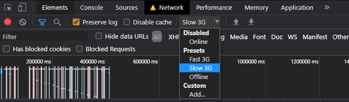</code>

These are your settings for the forced delay. I sell three, click for 15 seconds of payload, wait for refresh. Continue this cycle.

### HOWEVER!!
==========

As mentioned in my about section, I continue to improve. What I didnt do back then was look for another way to solve this challenge. As I am writing this blog, I am actually doing the challenges over again as I am writing after the competition is over. And I learned a new way to solve it with this.

<code>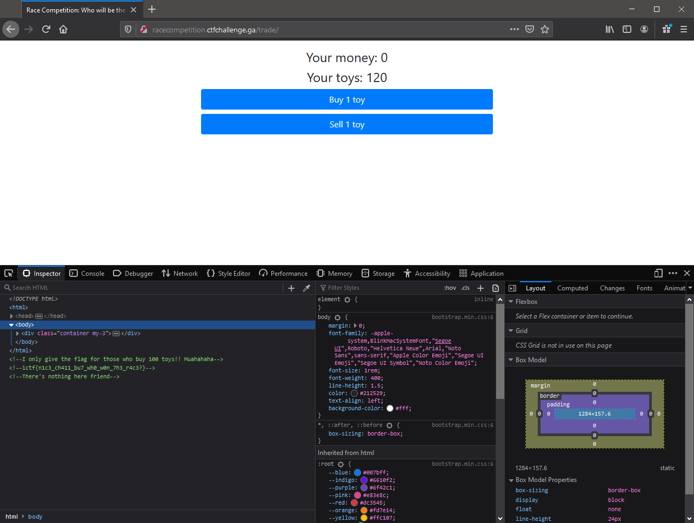</code>

Using the repo [PayloadsAllTheThings](https://github.com/swisskyrepo/PayloadsAllTheThings/blob/837d2641b776b2dd770e199cabe18d80cda77865/Race%20Condition/README.md), I am able to use a program called Turbo Intruder to send faster requests and a lot more sucessfull then both I offered before. Less than 3 seconds, I sent 60 requests and I got 60 toys out of that. Did it again after selling 10 toys, and got 120 toys.

This is our flag.

> ictf{n1c3_ch411_bu7_wh0_w0n_7h3_r4c3?}

# Santa's CTF 0x1

[Game]

> This app is not malicious so if you don't want to run it on a VM you don't have to.
>
> <https://fdownl.ga/BC5E4742B4>
>
>
>
>
>
>
>
>
>
>
>
>
>
>
>

<code>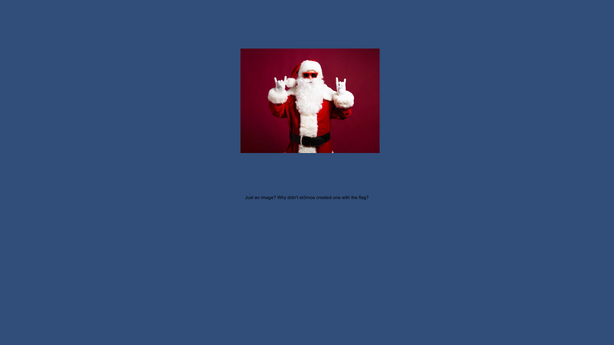</code>

An image?! Now this had me wondering. I think it was tjctf for me in the past that I dealt with a game requiring files, At that ctf I was not able to figure this out. But this time, though it did take a while, I knew to find a unity file extractor. Using [AssetStudio](https://github.com/Perfare/AssetStudio), I launched the gui and imported level 0 into the extractor. I then searched up ictf to get this flag. 

<code>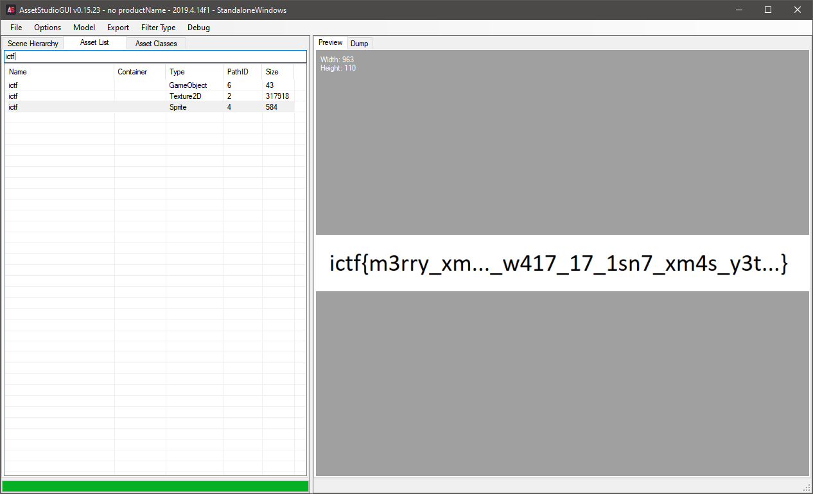</code>

This is our flag.

> ictf{m3rry_xm..._w417_17_1sn7_xm4s_y3t...}

# broken-png3

[Forensics]

> Third problem for the Fix Broken PNG series.
>
> <https://fdownl.ga/3E245D326F>
>
>
>
>
>
>
>
>
>
>
>
>
>
>
>

Now was this the jackpot in image fixing difficulty. Using [libpng](http://www.libpng.org/pub/png/spec/1.2/PNG-Contents.html) I was able to note down everything that was incorrect with assumptions, the PLTE, IDAT, pHYs, and the PNG Header. After fixing all of these we get the flag

This is our flag.

> ictf{I_m_done_No_manual_fixing_Only_automated_tools_for_broken_PNGs_from_now_on}

# Call Me

[Crypto]

> Bob's phone number seems a little big... Flag format is ictf{what_you_get_here}. Make sure to add underscores in between words.
>
> ```8-44-444-7777-0-444-7777-0-66-666-8-0-2-0-7-44-666-66-33-0-66-88-6-22-33-777```
>
>
>
>
>
>
>
>
>
>
>
>
>
>
>

DMTF challenge as it is all numbers and the dashes represent spaces. Use this [website](https://en.wikipedia.org/wiki/Telephone_keypad) to translate the numbers to letters. 

This is our flag.

> ictf{THIS_IS_NOT_A_PHONE_NUMBER}

# homemade-xor1

[Crypto]

> Several people complained about my last homemade XOR. So here is one with full recipe (flag is redacted). Provided in attachments are the recipe in C and the result of ./xorr > homemade1.txt
>
> <https://s1.fdownl.ga/38DF789CE6-xorr.c>
>
> <https://s1.fdownl.ga/855BA0E6F6-homemade1.txt>
>
>
>
>
>
>
>
>
>
>
>
>
>

<code>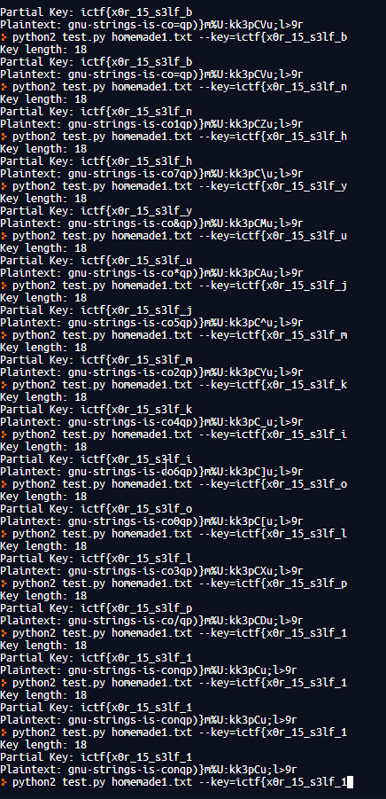</code>

I don't want to talk about this...

This is our flag.

> ictf{x0r_15_s3lf_1nv3rs3_and_@550c1@t1v3}

# see-the-past2

[OSINT]

> Here's an OSINT challenge for those who asked. Find the flag hidden on a reddit post. It was posted on Monday, December 7 2020.
>
>
>
>
>
>
>
>
>
>
>
>
>
>
>
>
>

Use [RedditSearch](https://redditsearch.io/) to search better on reddit.

<code>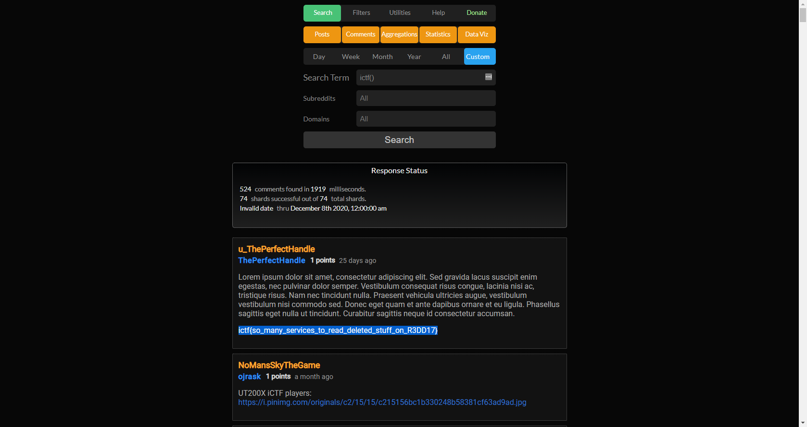</code>

This is our flag.

> ictf{so_many_services_to_read_deleted_stuff_on_R3DD17}

# Bad Naming 2

[RE]

> Timmy has gotten better at his skills. Hopefully this challenge should be easier, but looking at the points, I have a feeling its not going to be easier... Note: find out what `<REDACTED>` was, and put it after https://fdownl.ga/ to get the flag.
>
> <https://fdownl.ga/BC1607E8AF>
>
>
>
>
>
>
>
>
>
>
>
>
>
>
>

<code>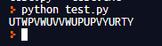</code>

Don't want to explain this either...

This is our flag.

> ictf{1$_71mmy_d01ng_7h1$_0n_purp0$3?}

# php-comparison

[RE]

> A web challenge for those who asked. This challenge is actually popular and reveals how a seemingly unrelated vulnerability could be dangerous.
>
> <http://test-imaginaryctf.rf.gd/login.php>
>
>
>
>
>
>
>
>
>
>
>
>
>
>
>

This was definitely a fun challenge and made me research a lot. If you go to base directory, you are able to see the other files. 

<code>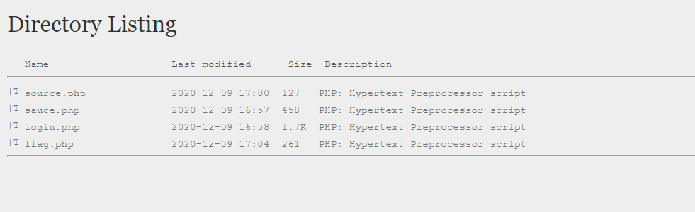</code>

We are unable to view the flag.php as it redirects to the login page, however if we are to check the source.php, we can see we have something similar to a modified magic hash. 

Magic hashes are hashes that equal one another and they exist to each encryption. The reason why this happens is because a hash cannot simply contain every string and at some point used up all of their character space. Therefore it writes over. 

```php
<?php
    if(isset($_POST['submit'])){
        $username = $_POST['username']; $password = $_POST['password'];
        if(strlen($username) == 14 && strlen($password) == 14 && $username != $password && md5($username) == md5($password)){
            $_SESSION['login'] = true; header('LOCATION:flag.php'); die();
            }
        {
          echo "<div class='alert alert-danger'>Username and Password do not satisfy the criteria.</div>";
        }
    }
?>
```

Magic hashes are generally different varients of 0. In this challenge, we are looking for two magic hashes equalling 0 and a length of 14.

Using the [spaze hashes](https://github.com/spaze/hashes/) repository, we are able to find these hashes and input them into the source. 

This is our flag.

> ictf{n3v3r_us3_l0053_c0mpar1s0ns_w1th_h@sh3s}

# The Government is Watching

[Crypto]

> They say that this was funded by the government, but we know better. Note: Thanks to @Zyphen#8624 for this challenge. Also, flag format is all caps, no underscores.
>
> <https://fdownl.ga/3365589B5D>
>
>
>
>
>
>
>
>
>
>
>
>
>
>
>

I don't think many people noticed, but the description was in reference to the game `Polybius`, also the name of the cipher. After using [dcode](https://www.dcode.fr/polybius-cipher) for this cipher, we are able to get the flag. 

This is our flag.

> ictf{G37R34DYF0R7H3N3XTCH411}

# 0r3Os

[Web]

> I found this very cool website about Sam Porcello, could you try breaking in?
>
> <http://oreos.ctfchallenge.ga/>
>
>
>
>
>
>
>
>
>
>
>
>
>
>
>

You could solve this challenge by using common usernames and passwords, along with setting your admin cookie to `True`.

Your login is `admin:admin`.

This is our flag.

> ictf{h1d1ng_1n_th3_c00kI3s}

# batmans-cipherkick

[Crypto]

> Don't worry it is not a RSA challenge, although similar. You just have to figure out exactly which crypto technique it is, there are no twists: should be easy to implement.
>
> <https://fdownl.ga/481C2B902F>
>
>
>
>
>
>
>
>
>
>
>
>
>
>
>

This was a difficult one to find the encryption algorithm, however once found, it made it a bit more easier. After figuring out this was a challenge in XMASCTF-2019, I was able to look at previous writeups and their solutions. I then did research into the encryption algorithm called `Rabins Public Key Cryptosystem`. Using this as a [base](https://github.com/duckbill360/Rabin-Public-Key-Cryptosystem/blob/master/Rabin.py), I wrote my [script](./rabins.py), with many outputs as backup.

This is our flag.

> ictf{Bez0ut5_c03ff1c1ent5?3xtended_3ucl1d_ftw}

# Stolen Time

[Misc]

> Our flag was stolen, but the robbery was really strange. We were left a mysterious note, and our agents don't know what to make of it. Can you help? Note: This note also doubles as a hint: Don't edit the document, you do not need to edit it to get the flag.
>
> <https://docs.google.com/document/d/1epy6RN7ANwfGGxF7ATEsVp4nYPPjnRorh9pEXsLrrYI/edit?usp=sharing>
>
>
>
>
>
>
>
>
>
>
>
>
>
>
>

The fact that it was a google doc means two things. Highlight everything or go into history, and after going into history, you will see the flag.

This is our flag.

> ictf{7h3_s70l3n_fl@g_1s_y0ur$}

# multi-prime-rsa

[Crypto]

> Just as they say, multi-prime RSA(MPRSA) is more efficient than the standard RSA. But the Chinese Remainder Theorem still applies and for a given n-bit modulus, factorizing MPRSA is much faster and easier than standard RSA.
>
> <https://fdownl.ga/C2597C6616>
>
>
>
>
>
>
>
>
>
>
>
>
>
>
>

This is a standard RSA challenge, finally, so I went to the first tool to do any rsa on. [RsaCTFTool](https://github.com/Ganapati/RsaCtfTool) by Ganapati. Using the command below I was able to get the flag. 

> python3 RsaCtfTool.py -n 775399408737742536342310058251627671605516680719681977785380980614769673360155521681258278946497661222017443341579481843 -e 65537 --uncipher 341215092162588660656453054653508800191099594248096552631559511785297631713720957685712816923044739366285835652968945472

<code>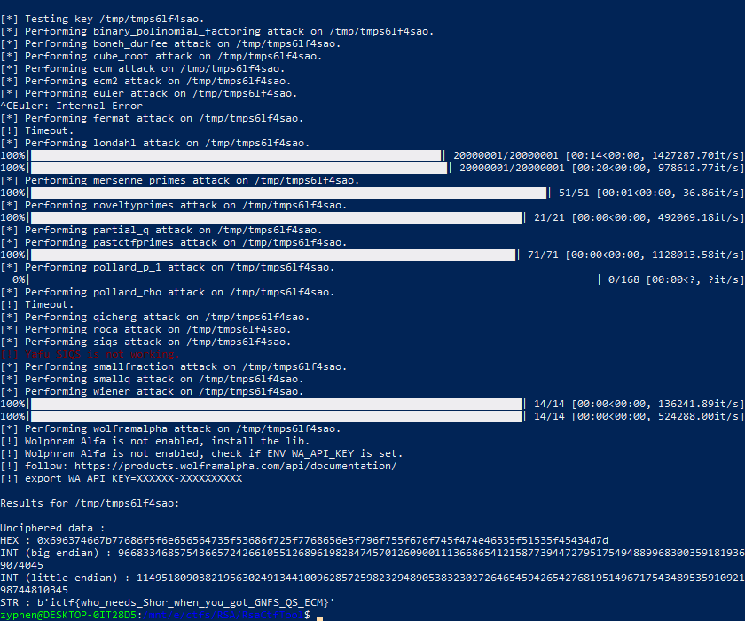</code>

This is our flag.

> ictf{who_needs_Shor_when_you_got_GNFS_QS_ECM}

# Santa's CTF 0x2

[Game]

> Second challenge of Unity Hacking series
>
> <https://fdownl.ga/C8897A696C>
>
>
>
>
>
>
>
>
>
>
>
>
>
>
>

Upon launch of the game, there seems to be a limit on the randomizer. Due to this, we are not able to beat the highscore. However, doing some research, we are able to find this [forum post](https://answers.unity.com/questions/1228111/where-playerprefs-data-is-stored-on-windows-in-uni.html)

<code>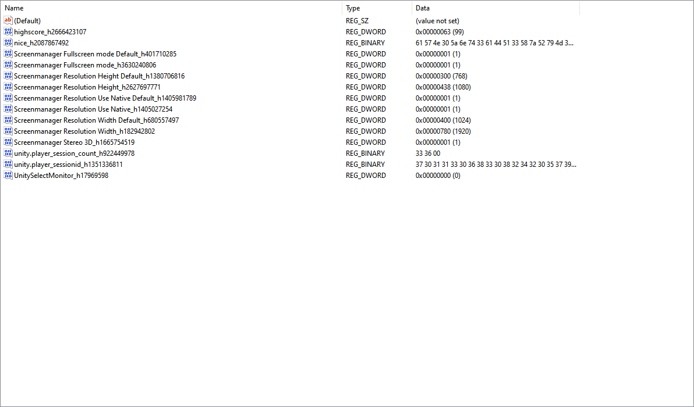</code>

Navigating to this directory, we see another regkey that was odd, called `nice...`. The value set to a base64 string, let's decode that using [base64decode](https://www.base64decode.org/)

<code>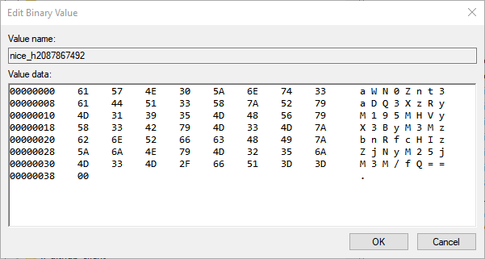</code>

This is our flag.

> ictf{wh47_4r3_y0ur_pr3s3nt_pr3f3r3nc3s?}

# WorldWide

[Crypto]

> I am trying to track down Mr. Reddington, the problem is, he doesn't stick to one place. Perhaps he's trying to send Elizabeth a message with the first letter. Note: Thanks to @Zyphen#8624 for this challenge. Also, flag format is all caps, no underscores.
>
> <https://fdownl.ga/51D1AB2DF4>
>
>
>
>
>
>
>
>
>
>
>
>
>
>
>

This challenge was made based from NACTF and that was also based on a challenge from PicoCTF, meant to be a starter. There is not much to explain except that you can do it manually or you can use a script. I used a script with geopy which is a lot better. I split each location with the parenthesis, and then printed each address and country. The flag is generally the first letter of one of these strings so be open to try both, but in this case it is the country leading into the `country[0]`.

BTW, there is a reference to this. It is from a show I am watching called `The Blacklist` and it is good. 

This is our flag.

> ictf{IREALLYHOPEYOUFOUNDORMADEASCRIPT}

# Hoi

[Crypto]

> Hoi
>
> 
>
>
>
>
>
>
>
>
>
>
>
>
>
>
>

There was no description, just Hoi. I thought it may have been a translation flag at first, but Hello failed. Therefore, I took a look into the discord, searching up hoi. That led me to a discord link into a math server, who the owner of is `korn#6969`. Then taking a look at their roles in the discord, its base 64.

After finding the correct arrangement of the characters, this is our flag.

> ictf{just_ignore_this_guy}

# Santa's CTF 0x3

[Game]

> 3rd challenge of Unity Hacking series.
Note: The input box can be buggy, sorry for that, just click in its right side
>
> <https://fdownl.ga/4285084F26>
>
>
>
>
>
>
>
>
>
>
>
>
>
>
>

This challenge was easier than the previous two. It involved using dnspy to look into Assembly-CSharp.dll file in the Data/Managed directory. 

<code>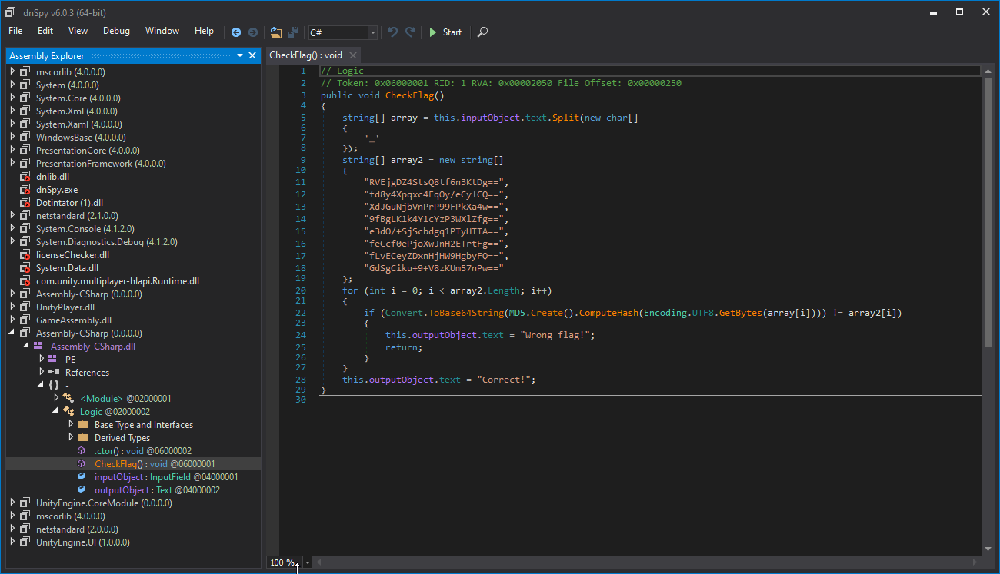</code>

This is what you are able to see. But some important things to consider is that it goes from text, to md5, to base64. MD5 is just 4 hex bytes, or 32 characters, therefore it goes from Base64 to Hex to Ascii in theory. Let's do that. Using [CyberChef](https://gchq.github.io/CyberChef/#recipe=From_Base64('A-Za-z0-9%2B/%3D',true)To_Hex('None',16)&input=UlZFamdEWjRTdHNROHRmNm4zS3REZz09CmZkOHk0WHBxeGM0RXFPeS9lQ3lsQ1E9PQpYZEpHdU5qYlZuUHJQOTlGUGtYYTR3PT0KOWZCZ0xLMWs0WTFjWXpQM1dYbFpmZz09CmUzZE8vK1NqU2NiZGdxMVBUeUhUVEE9PQpmZUNjZjBlUGpvWHdKbkgyRStydEZnPT0KZkx2RUNleVpEeG5IakhXOUhnYnlGUT09CkdkU2dDaWt1KzkrVjh6S1VtNTduUHc9PQ) and [Hashes](https://hashes.com/en/tools/hash_identifier).

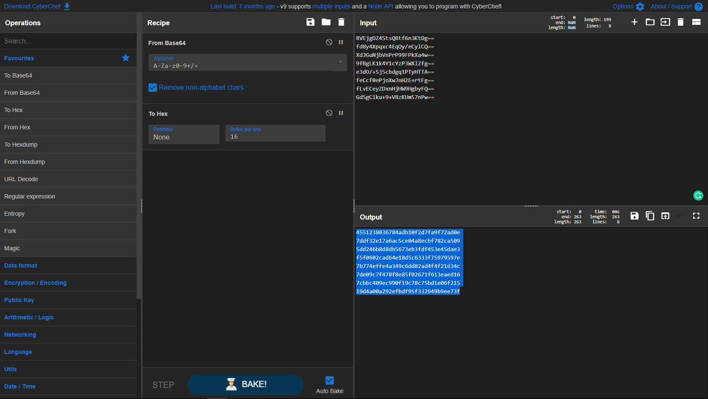

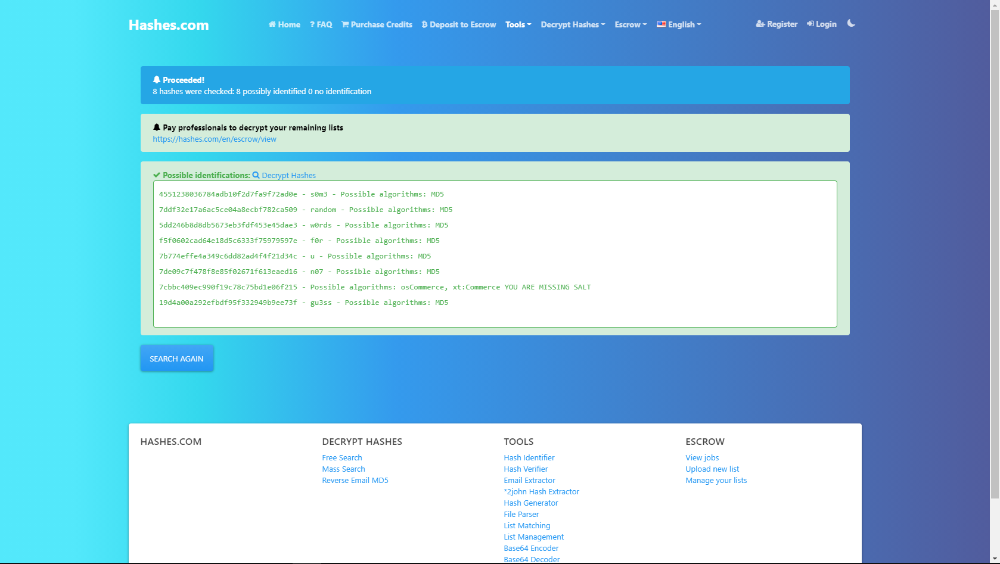


This is our flag.

> ictf{s0m3_random_w0rds_f0r_u_n07_70_gu3ss}

# Bread and Buffer

[Game]

> Yay! finally a pwn challenge. (Note: Just take your flag and leave, please don't exploit the service more than needed)
>
> `nc oreos.ctfchallenge.ga 33000`
>
>
>
>
>
>
>
>
>
>
>
>
>
>
>

In the category of being the easier fail-proof pwns, you can spam as many A's you want after buffer and get the flag.

This is our flag.

> ictf{0verfl0w1ng_buff3rs_1s_fuN}

# Tables

[Crypto]

> Custom made crypto challenge. Just know, its easier than it looks. Note: Thanks to @Zyphen#8624 for this challenge. Also, flag format is all caps, no underscores.
>
> <https://fdownl.ga/8556586904>
>
>
>
>
>
>
>
>
>
>
>
>
>
>
>

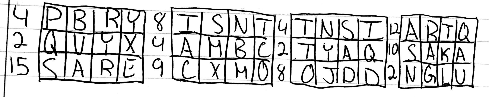

Now this did stump many people and with purpose, not to mention that I did hide some easter eggs to throw people off. Of which in this image was the siting of XMAS and SANTA. However the major key I gave to people who made support tickets is this message.

> I based this challenge based of an article I read about this Bitcoin puzzle that took 3 years to solve. It looked so complicated as it’s also a painting but the solution was actually surprisingly easy, letting the victor win 5 bitcoins

This description that included keywords led to [this article](https://www.vice.com/en/article/kzpqzz/heres-the-solution-to-the-3-year-old-dollar50000-bitcoin-puzzle) or a bitcoinst article. In which explained a binary mask, which was this challenge's objective.

```
 4 PBRY  8 ISNT  4 TNSI 12 ARTQ
 2 QVYX  4 AMBC  2 TYAQ 10 SAKA
15 SARE  9 CXMO  8 OJDD  2 NGLU
```

When converting each number, it will be in binary, the ones represent which letter to choose from, leading us to our flag. 

This is our flag.

> ictf{BINARYMASKSARECOOL}

# Spaceman

[Forensics]

> We went to the moon, but where is the conspiracy? An insider gave me the message, but what do we do? Note: Thanks to @Zyphen#8624 for this challenge. Also note that there are 2 flags, individually each worth 50 points.
>
> <https://fdownl.ga/4E4FDA9515>
>
>
>
>
>
>
>
>
>
>
>
>
>
>
>

I did think there would be more solves faster even if believed by chance. The first flag being easy as expected, the second flag was using Futureboy steganography tool. The first flag may be solved using a SSTV tool, which was also used in the space missions to send back images using sound. The second part, however, was a little difficult.

Here is the first flag:

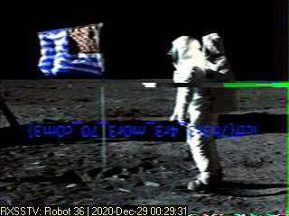

Don't forget to rotate the image!!!

For the second flag we needed to SSTV the second audio as well, called `quack`.

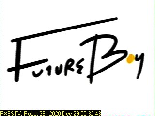

Once you have done both you can also search up futureboy to get the steganography tool to get the message from the first one. As much as this sounded easy, here is where the hardest part of the challenge comes in. Use the first flag to find the second as the key. I provided a hint for this flag to make sure people got it due to the low solve rate, next time I will try to make it a lot more notable, this was one of the only flags of mine that was the most guessy.  

This is our flag.

> ictf{7h3r3_4r3_m0r3_70_c0m3}
>
> ictf{0r_w4s_i7_411_4_c0nsp1r4cy}