ICTF is a practice competition that does not equate to much except for practice. However, this does not mean they are all easy. These challenges are meant to simulate real ones, usage of websites, terminal, pwning, and so much more. All just for practice with the work and dedication of the board team. They generally release challenges once on the daily and reset the round every month. If you would like to join, click on the link below.

> <https://discord.gg/Z4Vn9bw2uX>

**AFTERNOTE:** I was busy this month so I did not complete as many challenges as possible, but I will be posting the ones that I have done.

# Sanity Check Round 6

[Misc]

> Welcome to round 6! Can you believe that it's already a new year? Anyway, I made a new year's resolution to make sure everybody is still sane after 2020. Good luck!
>
>ictf{w31c0m3_t0_2021_4nd_r0und_6!}

This is just a starting challenge for those new to understand how the round starts and how to submit flags. You may join in at anytime but for those waiting for the new round is perfect for them. 

This is the flag.

> ictf{w31c0m3_t0_2021_4nd_r0und_6!}

# a-fine-year

[Crypto]

> Last year has been tough for a lot of us. Congratulations on making it through.
Have fun with the CTFs.
>
> bfyq{gpssz_cvj_zvpi_gxsbcl_qxi_p_kvyyvi_xcv}
>
>
>
>
>
>
>
>
>
>
>
>
>
>
>

I did start out thinking this may have been a caesar cipher puzzle. With this I went to my go to website [cryptii](https://cryptii.com/). However, I later figured out none of them worked. So I switched to the next best, Affine cipher. I was able to get the flag on a slope of 5 and intecept of 29.

<code>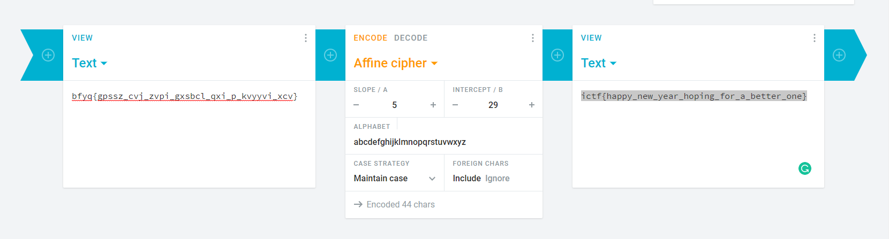</code>

This is the flag.

> ictf{happy_new_year_hoping_for_a_better_one}

# Format

[Crypto]

> I used a keyword cipher to encode this. I wonder if you can just guess the 4 letter keyword... Note: The flag is in flag format ICTF{YOUR_FLAG_HERE} in all caps.
>
>
>
> 
>
>
>
>
>
>
>
>
>
>
>
>
>

This, although not a new one, was one I have not seen in a while. A classical cryptogram. One where you guess the letters and how the message fits together. Well, atleast that is how I solved it including another contestant. 

Using [boxentriq](https://www.boxentriq.com/code-breaking/cryptogram), I was able to guess what letters go into each position. We could start with the ICTF at the beginning, then guess every letter after that. Since the name of the challenge is format, and we do have f and t in a six lettered spacing, we can put down format in the corresponding letters.

Please do inform me if you had another way to solve.

> EDIT: One solve was found using a keyword cipher at [secretcodebreaker](https://www.secretcodebreaker.com/keyword.html) using the key HOME <code>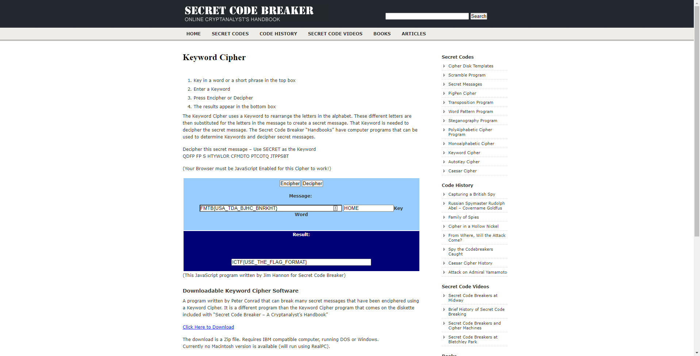</code> Or you may also use cyberchef. <code>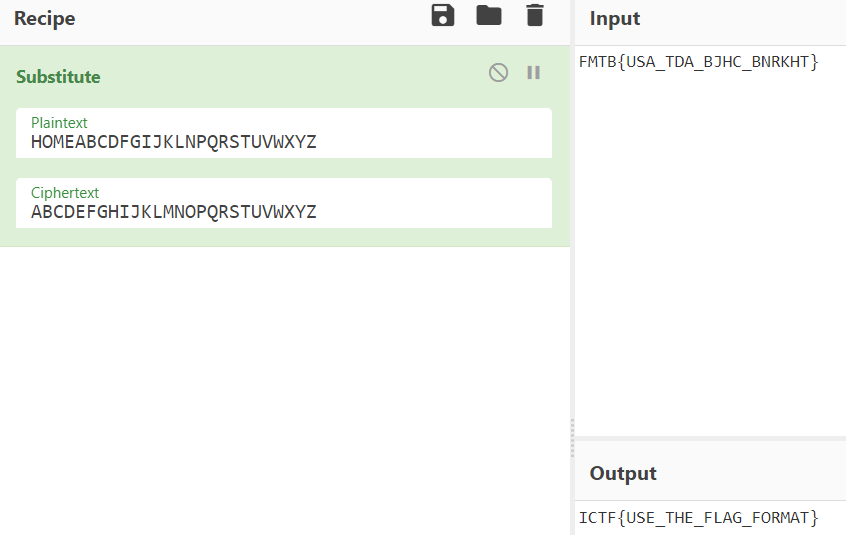</code>

This is the flag.

> ICTF{USE_THE_FLAG_FORMAT}

# wertyu

[Misc]

> The answer to this puzzle is right in front of you. Have a good look.
>
> ovyg{djogytu@o+vjppdr+upi}
>
> 
>
>
>
>
>
>
>
>
>
>
>
>
>

This was not too hard to figure out what was happenining. It seems like the qwerty keyboard was shifted one to the right, literally. Usining [dcode](https://www.dcode.fr/keyboard-shift-cipher), I was able to insert the string and solve. 

This is the flag.

> ictf{shiftry!i_choose_you}

# Web comments

[Web]

> I like commenting on websites, but this site went too fast... :(
>
> http://oreos.ctfchallenge.ga/
>
>
>
>
>
>
>
>
>
>
>
>
>
>
>

With this challenge, it seems that there was a message in one of these urls, so I guess it is time to figure out which redirection, before the rick roll, is our flag. This seems like a challenge for [BurpSuite](https://portswigger.net/burp). I do not think I explained this before, but to use Burp, I use Firefox.

<code>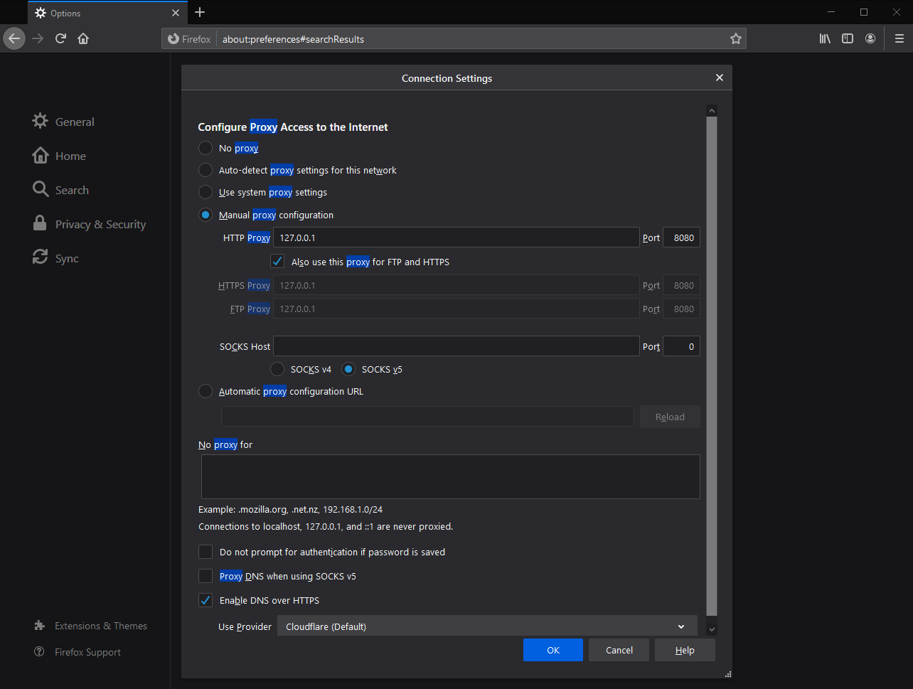</code>

Changing the proxy to local host and setting port to 8080, you will now be able to connect to Burp. Then it is a matter of going to the proxy tab and enabling every request that comes by when you go to the site.

<code>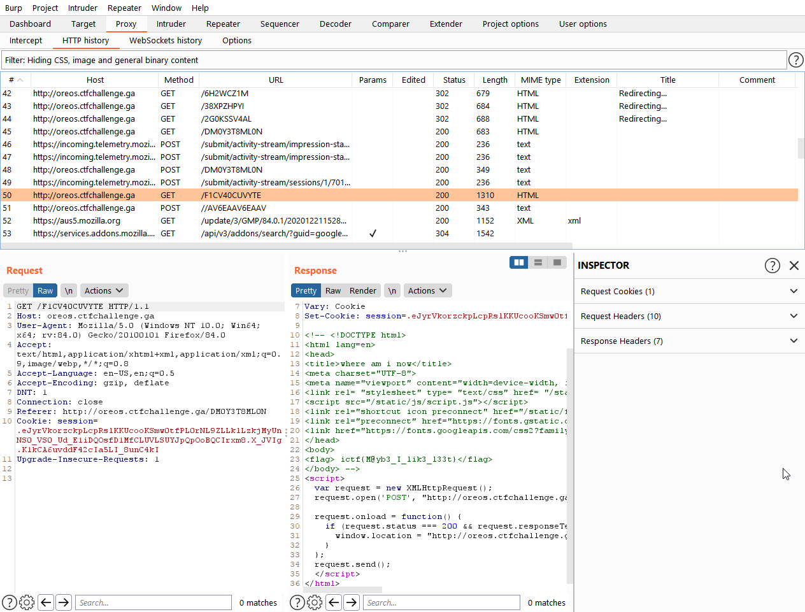</code>

After finishing, you may go back into the proxy tab and go back through **HTTP History** and go through each request to find the flag. It seems it is in the comments. 

This is the flag.

> ictf{M@yb3_I_lik3_l33t}

# breaking-bad

[Programming]

> A friend gave me this nested zip file and wants me to open it. Every password is the name of a Breaking Bad character followed by two underscores and then their nickname.  
>
> He also named the zip files as md5 of the password used.
>
> (For example, the password for a file can be Walter White__Heisenberg and its name would be 512a73318ba4dd5c424fcec5ee2c04f3.zip) 
>
> By the way, do you know what an API is?
>
> <https://fdownl.ga/930E810D53>
>
>
>
>
>
>
>
>
>

With this challenge, I saw how the names of these files are md5, therefore I just needed to make the wordlist to crack the names. I tried to look online prior for the word lists, however none were found. Therefore I had to find a API to create my own wordlist. As the challenge states, the API I used was one called [breakingbadapi](https://www.breakingbadapi.com).

<code>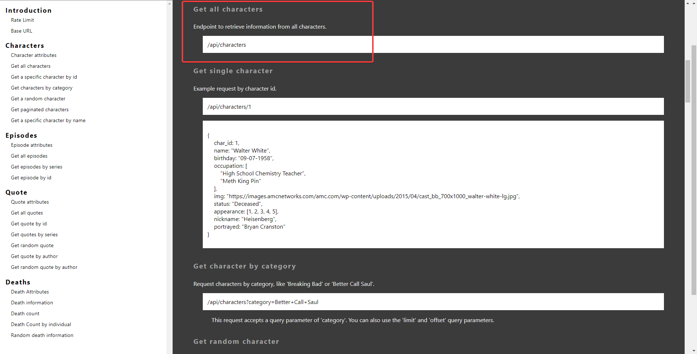</code>

This is the section I came to for focusing on, using this script we are able to print out the contents. 

```python
import requests
import json

response = requests.get("https://www.breakingbadapi.com/api/characters")
print(response.json())
```
This prints out the following.

<code>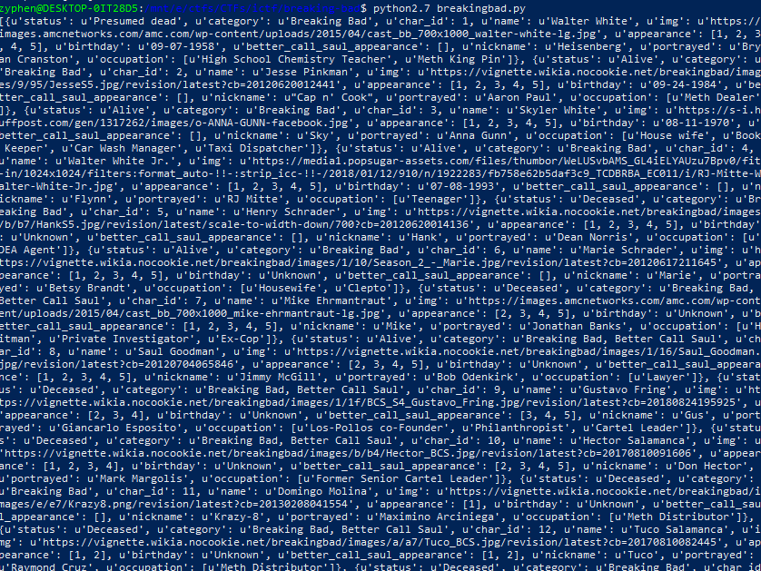</code>

It is a mess, but as it is in a json format, we can easily clean this up.

<code>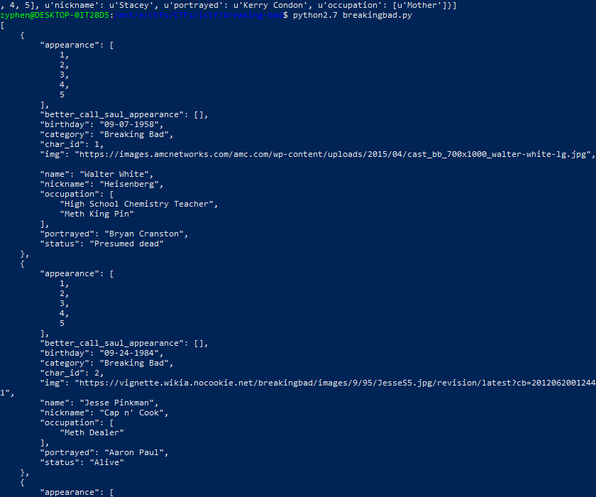</code>

Now that we could actually read this, lets figure out how to get every name in the list. Using this [script](./breakingbad.py), I am able to now grab every user and output them to a file. It is important to note that in the description of it says that the character, Walter White, also has an extension of his nickname from the show, `Heisenberg` preceded by two underscores. This is what this script does.

Now that we have the wordlist, we should be able to hashcat each file name using the following commands. First is to make the word list, second is to get the password of the zipfile

> python2.7 breakingbad.py > breakingbad.txt
>
> .\hashcat.exe -m 0 -a 0 3ec9085f6b33c86fbccd2d191c0542b2 .\breakingbad.txt

This will get you the first password. However the more I do this, the more of a hassle it becomes, seeming unendlessly having more zips within zips. I think it is time to automate this flag. Using [zipfile documentation](https://docs.python.org/3/library/zipfile.html#zipfile-objects), I was able to extract each file with its password in a for and while loop. 

Using this [script](./bbauto.py), I am now able to get the flag almost immediately. It is important to note that we had to use python2.7 for obtaining this flag. 

This is the flag.

> ictf{4ut0mat10n_1zz_da_wa3}

# Ballymote

[Crypto]

> Ballymote is an interesting place to visit! Note: The flag format is all caps, with no underscores.
>
> <https://fdownl.ga/5713BC3A75>
>
>
>
>
>
>
>
>
>
>
>
>
>
>
>

<code>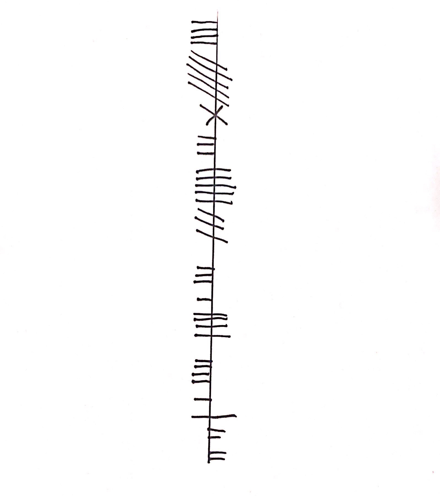</code>

On this challenge we are presented with a lot of lines on paper. But the lines Mason, what do they mean? The only hint that we have is Ballymote, which leads us into an Irish town called Ballymote. It also seems to have ruins of fortresses and castles which was fun. I wrote this challenge based on the Ogham language. If you travel to the book of Ballymote using the [Ballymote's Wiki](https://en.wikipedia.org/wiki/Ballymote), you will see the only depiction of a writing and language, which is our key. Travelling down Ogham, you will be able to see a language that looks familiar to ours.

<code></code>

Decoding the message, this is the flag.

> ictf{CREATINGTHECHALL}

# Esolang

Just look into popular esolangs, its malbouge
http://malbolge.doleczek.pl/

> ictf{n0_est03r1c_n0_pr0bl3m}


# Katarina Rostova

[Forensics]

> "I only do these things for you Elizabeth... I am always honest" - Reddington.
>
> <https://fdownl.ga/BC85212B2B>
>
>
>
>
>
>
>
>
>
>
>
>
>
>
>

Let us figure out if what Reddington says to Elizabeth is true. We start out with opening the IMG with 7ZIP. 7ZIP is generally better than winrar in this case as it can easily extract and gather files from .img's. With this knowledge, inside the file we see a stars.zip, with a decent file size. Extracting and opening up this archive, with Winrar, I can see thousands of files with the same name and date. You can do this of two ways, sort by size or sort by CRC32. 

<code>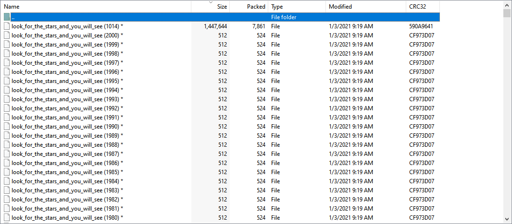</code>

However, there is a problem, there is a password on these files indicated by the stars. So now let us figure out what flag this is. The general way to get a password out of a .zip or a .rar is to get the hash of the file, then run hashcat or johntheripper with a wordlist and get the password. Using [onlinehashcrack](https://www.onlinehashcrack.com/tools-zip-rar-7z-archive-hash-extractor.php), which uses johntheripper to get the hash, but it failed. Using a couple of more sites, they too fail. So, how are we supposed to get the hash?

When I making this a challenge I considered this will be a problem for those not exposed to more tools. One of which is the basic `fcrackzip` on linux systems. Automatically installed on Kali, manually installed on Ubuntu. With this I am able to bruteforce the password, however fcrack does something smarter by consulting the internet. However, it makes it easier, for future challenges, if we specify a word count to begin with so it has less to search and prededicates less processing power.  

> `fcrackzip -b -c a -l 1-10 -u stars.zip`

Using this command, we are able to get the password `masha`. Now we can extract that file, 1014. After extraction, we can open the file in a texteditor to see what type of file it is. As it is a RIFF file, it seems to be an audio file `.wav`. After appending the filename with a .wav, we can finally listen to it. However, there seems to be a 3 minute long morse code. Using my goto website for morse code, [morsecodeworld](https://morsecode.world/international/decoder/audio-decoder-adaptive.html), we can input the file and wait 3 minutes to get what seems like 6 md5 strings. 

<code>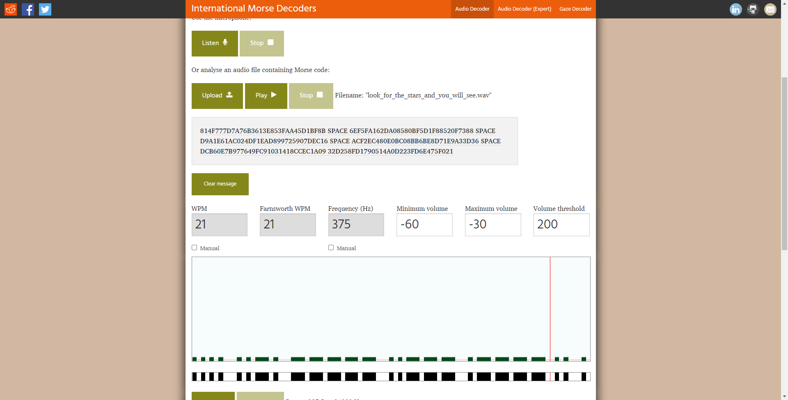</code>

Going to [hashes](https://hashes.com/en/decrypt/hash)

Reorganizing the message, this is the flag.

> ictf{sometimes_I_wonder_who_we_are_}

# Denso's Matrix

[Forensics]

> I was talking to Denso today, and he said he wanted me to solve a puzzle about a matrix. I didn't think it would be made out of these! What do they mean???
>
> <https://fdownl.ga/AB72469D7A>
>
>
>
>
>
>
>
>
>
>
>
>
>
>
>

The two command solution you may ask?!

```bash
convert -crop 70x70 barcode_clean.png qrcodes/tile_%d.png
for i in qrcodes/*; do zbarimg -S*.enable $i 2>&1; done | grep ictf
```

# CeWL

[Cracking]

> I am really close to finding out my surgeon friend's password. I currently have a SHA256 hash and I am dead sure he used one of the long medical terms from here and salted it with surgeon. Help me recover the plaintext please.
>
> Note: The flag is ictf{plaintext_you_got}
>
> `86515c560fe63bb69f89661e9c6a9a0b5f9a79703af9ddf5eee6e27a117ea1e1`
>
>
>
>
>
>
>
>
>
>
>
>
>
>
>

I did not know CeWL existed but I made my own script with Soup to get all words and output them into a file. Then used hashcat after identifying the hash.

`.\hashcat.exe -m 1400 -a 0 .\Coronaryarterybypasssurgery.txt .\hashcat.bin`

> Revascualrisationsurgeon

# Zyphen's Chamber

[Reversing/Crypto]

A personal shoutout to [AZ-0 Writeup](https://github.com/AZ-0/Writeups/tree/main/january_2021_ictf_round_6/zyphen_s_chamber), who went for all the points I wanted to showcase exactly.

# php-comparison2

[Web]

Researching leads you to this [site](https://blog.csdn.net/u013512548/article/details/108213295)

<http://php2-ictf.rf.gd/?param1=0e215962017&param2=0e730083352>

> ictf{7h15_15_h1lari0u5!_5tr1ng_3qual5_ha5h_0f_1t53lf}

# Basics of PWN

[Pwn]

> Find the secret, find the message, it is as easy as that. Anyway, welcome to PWN!
>
> `nc 52.201.238.52 4000`
>
> <https://fdownl.ga/FDD50710ED>

Our point of entry is at rbp-0x8

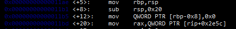

and this is our check

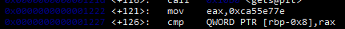

if I understand correctly, rbp was first intialized with a 32 bit value, the point of subtracting rsp,0x20 was to clear this 32 bit value to create free space, and to then push it to the top of the stack with mov. With this in mind, mov will push the rbp value to the top as well and place it into the 32 empty slot. This would mean a 24 character input to access our variable or check. Here, we can then enter ca55e77e in little endian format to get access to /bin/bash, and we are able to cat flag.txt. Worst case scenario, I could also just brute the buffer and then insert hex.

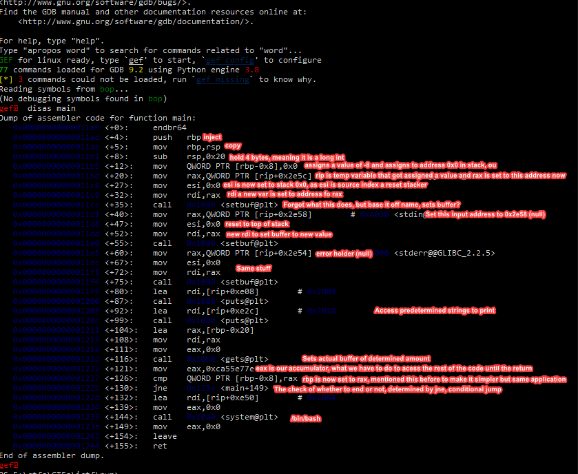

# Windows

[Miscellaneous]

> Ishida gave me this puzzle, reminded me of sudoku, but at the same time different. Said something about windows?
>
> <https://fdownl.ga/B664193799>

<http://a.teall.info/nonogram/>

> ICTF{NONOSQUAREFUNS}

# pyjail0

[Misc(jail-escape)]

> Your mission, should you choose to accept it, is to escape the pyjail and read the contents of flag. For your convenience, the flag is located in flag.txt in ctf directory.
>
> `nc pyjail0.westus.azurecontainer.io 1337`

If we print Blacklist, we see a lot of things in the blacklist filter. However, we should take note that it is an array, meaning we can pop an index out of the array and then use the commands.

```python
Blacklist.pop()
os.open("flag.txt").read()
```
