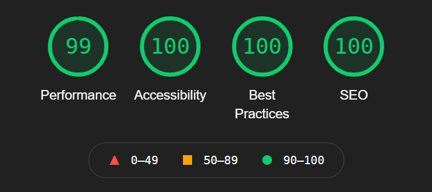

Welcome to a new website! There are a lot more improvements on this site, and a new theme to follow. This is slightly based on Minh Duong's theme of gatsby, but customized it to my own.

As stated, this site was built using [Gatsby](https://www.gatsbyjs.com/), a static site generator based on the React framework. In other words, it's pretty fast.

<figure>
    
    <figcaption>
        An almost perfect Lighthouse report for the home page!
    </figcaption>
</figure>

This is the report Minh had, but the benefits of this site, also provides responsiveness on a whole new level!

This includes:
- Comment system using GitHub issues (utterances)
- Fancy animations/transitions while navigating
- MDX support for blog posts, like this one
- Support for clients without JavaScript
- A11Y friendly
- Dark mode :)

The source code for this site is available on [GitHub](https://github.com/ZyphenSVC/zyphensvc.com)

## What's next?

Will be posting a bit more frequently on new and exciting projects I have to offer. This will of course have the occasional ctf writeup, but more so on projects!

Make sure to follow my [Twitter](https://twitter.com/ZyphenSVC) for announcements. You can friend me on Discord with [Zyphen#8624](https://discord.com/users/328580491290607616). Additionally, you can add my [RSS feed](https://zyphensvc.com/rss.xml) to your favourite reader app. Hope you enjoy!