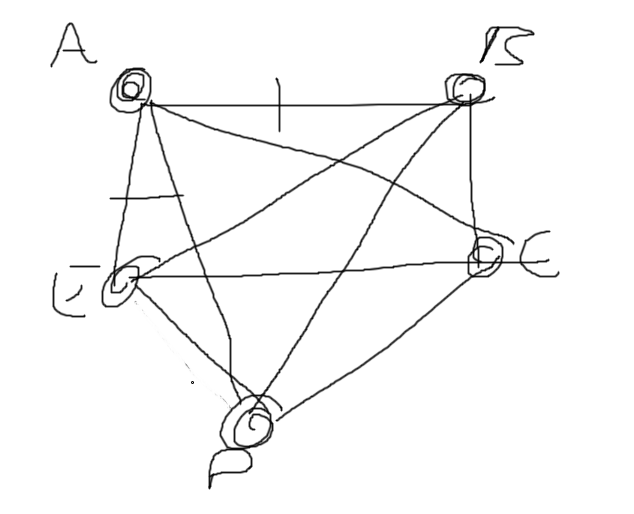
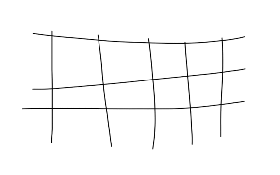
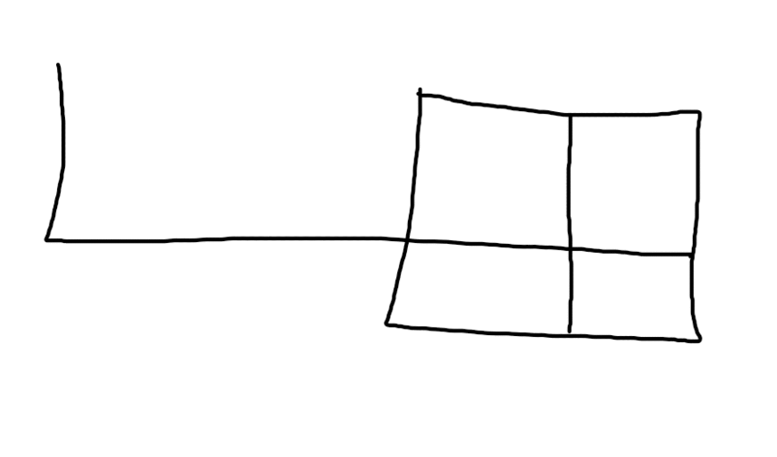
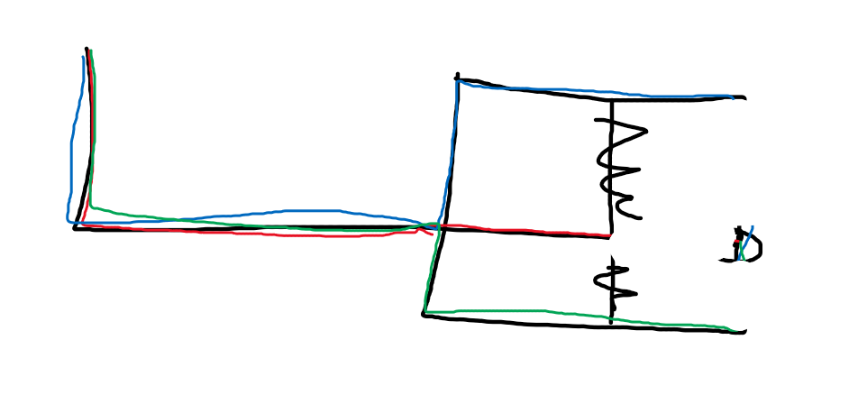
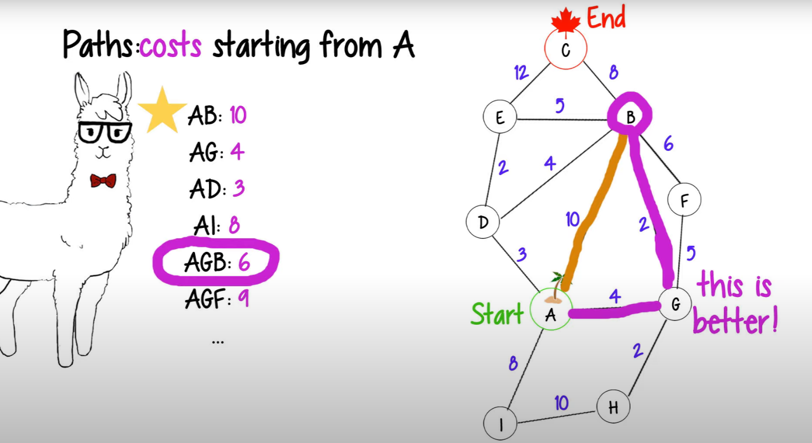
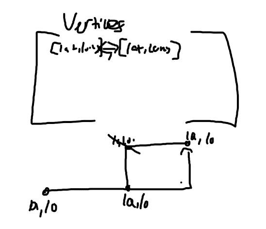
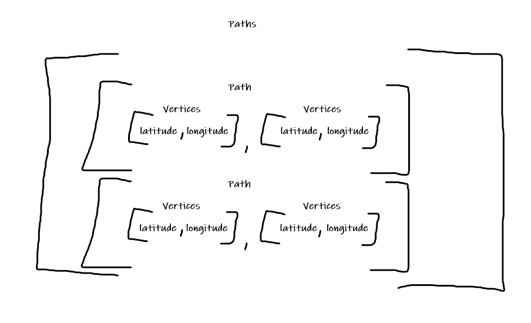

<!-- October 26th 2021 -->

> Forenote

```md
Google's “20% Time”, inspired by Sergey Brin's and Larry Page's Montessori School experience, is a philosophy and policy that every Google employee spends 20% of their time (the equivalent of a full work day each week) working on ideas and projects that interest that employee. Ideas like Gmail, Google News, and AdSense have been developed from this working model. 

This website is a project I am working on in my senior English literature and composition course. During this project I will be spending 20% of my class time working on developing my idea through a progressive process to its final product. This website will be a space where I update visitors on the progress of my idea for this project. Thank you for visiting and I hope you follow along on my journey.

D’Onfro, Jillian. “The Truth about Google’s Famous ‘20% Time’ Policy.” Business Insider, Business Insider, 17 Apr. 2015, http://www.businessinsider.com/google-20-percent-time-policy-2015-4  
```

# Introduction

A friend of mine approached me on the 21st.

<br />
<p class="tab">
<code>22:48 <b>Eric</b> Uh Sri. Do you want to work on a [Georgia Tech] project?</code>
</p>
<p class="tab">
<code>22:50 <b>Me</b> What kind of project?</code>
</p>
<p class="tab">
<code>22:51 <b>Eric</b> A computer program that can automatically draw out a trail for someone to take for a walk, based off of data from open street map, and ideas from this class. For example, to avoid going on the same path twice.</code>
</p>
<br />

This was a project for Eric's GT Calc class Year Two. He is now taking Applied Combinatorics and is working on one project of application. His final project. 

I was intrigued, but I know the direction this would head. This would require pathfinding, as suggested, and it was something I was not fully capable of.

He asked a few more of my other friends. Each of them also rejected his offer. The effort required to put into this project, especially at a time we needed to focus on our school and college apps. We didnt have enough.

On the night of the 24th, Eric joined our Discord call and was working -I would say rather poorly- on writing code for this project. Asking me questions and teaching him when needed. But I understood, that it was something he was going to do regardless of what we say.

I decided on the 25th to accept his proposal.

That early morning at `12:00 A.M.`, we had a conversation that lasted around three hours. That was how long it took me to plan and organise how this project would look like.

# Conversation

During those three hours, he gave me a run down on what the project was about in depth. Everything from Dijkstra's Algorithm, Eulerian Circuits, and the project requirements themselves.

Eric felt like this was an easy project. He is not wrong, but the moment we include street maps, this project becomes a boss level difficulty. So it was something that kept bothering me in the back of my mind.

These are the notes that I have taken on this conversation. 

```md
/*
    Five parts
     - Converting street map into a 2D array - Maybe long lat
         - Each array being an degree (vertices) (ab, ba)
     - Path is made of a string
         - All degrees exist only once in that (triangle abc, b is center)
             - but in (abcdefaghi) `a` is repeated twice meaning not possible
     - Eulerian Circuit
         - Starts and ends at the same circuit
             - a at the beginning and at end
             - Every edge is only crossed once
             - Every vertex needs even # of degrees attached
     - Find # of road blocks
         - Find new path depending on road blocks
         - While true, ask where to put roadblock
             - Delete edge in array
                 - Create a new path without that edge
     - Find # of entries that have a roadblock
         - Find if even or odd
             - If odd then no path
                 - No paths can be found if odd
             - If even Find # of path
 */
```

Perfect, we now have a pretty ~~basic~~ idea of what Eric wants from this project. I look back now and realize, that I signed up for something I am not ready for...

During this time, we also drew a couple of rough sketches of how Eulerian Circuits work.



As long as we have an equal amount of degrees per vertices, then it is solves the Eulerian Circuit. Crazy right?! 

But this is where my confusion comes in. We need to combine the path with an Eulerian Circuit. Meaning in a fixed radius of streets, we will take out all vertices of odd degrees. 



This gif demonstrates how this project would work out. This cleared up my confusion once Eric explained how an Eulerian Circuit would apply and add more restrictions to the path.

So now lets demonstrate an example of this project.



We should be able to take out a degree each time we finish and connect a vertices. Meaning less and less paths are possible. But, how about the two center values?



Technically, this is a false diagram of this concept working. Aren't there only three degrees attached to the point in the top-middle and bottom-middle. Which means we should immediately take out the degrees left and right of them. Which also leaves the corners only have one degree and therefore taking them out.

Wow, our job became really simple in a matter of seconds. As a human, evidently, I am prone to making mistakes explaining this, but as soon as we do have a computer doing this logic, perhaps we could experience the beauty of it all.

# Research

### Dijkstra's Algorithm

When taking a look into this project, I immediately wanted to learn more about Dijkstra's Algorithm. In the world of pathfinding, he's famous. After watching multiple youtube videos, looking into code examples here is what I have.

<a href="https://youtu.be/2_MEgc_rbQ4"></a>

<figcaption align="center"><b>Fig.1</b></figcaption>

- Important for compression and blockchain
- Finds the shortest path between the start and end goal
    - It does this by picking every single possible path and chooses the smallest cost
    - Insanely inefficient
- How can we make this faster?
    - Look for red flags
    - Choose one vertices on way towards the destination.
        - Find all degree cost values
    - In Figure 1, we have demonstrated this concept
        - Since AGB is a shorter distance to B, we could eliminate all paths using AB
            - Called local optimization

### Blacklisting Roads

This comes to the second part of our problem.

How are we going to add roadblocks or blacklist a road. In our conversation, we made a demonstration showing how the path, once completed, gets removed. Therefore, the computer needs to find a completely new path.

After some more research, this is what we need to do. We have to list all possible paths, then remove the ones using the blacklisted road, then add it to the new array.

I feel like this would require some form of a recursive function, and this is also scaring me thinking I have to move beyond the concept of a 2D array and into a 3D array.



This was my 2D Array logic I had before, it would map all vertices into a 2D array. But how about when we need to place all vertices in a path into a new system? Wouldn't this require a 3D array. So likely we will be using both a 2D and a 3D array, which complicates things further.



This is now the new logic of the system.

So back to blacklisting roads. How can we do this?

According to this [stackoverflow question](https://stackoverflow.com/a/2457979), we should be able to get a list of all directions using the provideRouteAlternatives function.

Or apparently [MapQuest](https://developer.mapquest.com) also works. [Github](https://github.com/gjordi/mapquest-open-geocoding).

Another alternative [Here](https://developer.here.com/).

This is the amount of research I did for now, I will keep you updated in blogs.