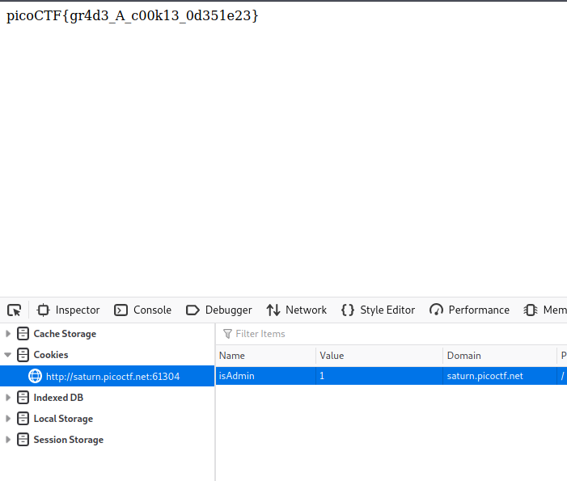
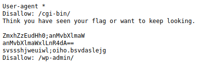

# Includes

Looking through the sources you will be able to find the two parts of the flag in the css file and js file attached in the head tags of source.

> picoCTF{1nclu51v17y_1of2_f7w_2of2_b8f4b022}

# Inspect HTML

Check source to get the flag

> picoCTF{1n5p3t0r_0f_h7ml_fd5d57bd}

# Local Authority

After having a failed login attempt, you should be able to find the secure.js attached to login.php.

```
USER: admin
PASS: strongPassword098765
```

Logging in gives us the flag

> picoCTF{j5_15_7r4n5p4r3n7_b0c2c9cb} 


# Search Source

The flag is the style.css of the website, then search for `pico`

> picoCTF{1nsp3ti0n_0f_w3bpag3s_8de925a7}

# Forbidden Paths

By using directory transversal in the prompt given, we are able to read the flag file

`../../../../../../flag.txt`

> picoCTF{7h3_p47h_70_5ucc355_e5a6fcbc}

# Power Cookie

When we access the website, we are given an option to join the website as guest. But that is all we are left with.

However if we look at the storage of the developer tools, we will see a cookie called isAdmin. Setting it to 1 and then refreshing brings us the flag.



> picoCTF{gr4d3_A_c00k13_0d351e23}

# Roboto Sans

Check the robots.txt.



This prevents webcrawlers from accessing certain parts of the sites.

When we base64 decode the contents, we are able to see that these are files hidden in this encoding.

Lets access one of these directories at `js/myfile.txt`.

We got our flag.

> picoCTF{Who_D03sN7_L1k5_90B0T5_032f1c2b}

# Secrets

This is manual directory transversal using source. We see in initial source there is a folder called secrets.

When scouting the directory of <http://saturn.picoctf.net:49917/secret/>, we see an image file and another folder called hidden.

When scouting the directory of <http://saturn.picoctf.net:49917/secret/hidden/>, we see a login page and a folder called superhidden.

Finally in the superhidden directory, we get our flag.

> picoCTF{succ3ss_@h3n1c@10n_790d2615}

# SQL Direct

```sql
pico=# \d
         List of relations
 Schema | Name  | Type  |  Owner   
--------+-------+-------+----------
 public | flags | table | postgres
(1 row)

pico=# select * from flags
pico-# ;
 id | firstname | lastname  |                address                 
----+-----------+-----------+----------------------------------------
  1 | Luke      | Skywalker | picoCTF{L3arN_S0m3_5qL_t0d4Y_21c94904}
  2 | Leia      | Organa    | Alderaan
  3 | Han       | Solo      | Corellia
(3 rows)

pico=# 
```

We got our flag.

> picoCTF{L3arN_S0m3_5qL_t0d4Y_21c94904}

# SQLiLite

```
username: admin
password: admin
SQL query: SELECT * FROM users WHERE name='admin' AND password='admin'

Login failed.
```

With this in mind, we can replace the last password statement to an always true statement.

```
USER: admin
PASS: ' OR 1=1--
```

Using these credentials we can login and check source to find the flag.

> picoCTF{L00k5_l1k3_y0u_solv3d_it_ec8a64c7}